# QNet: The Invisible Overlay Network

<div align="center">
  
  <p><strong>Decentralized. Censorship-Resistant. Unblockable.</strong></p>
</div>

---

> [!CAUTION]
> Most of the code has been implemented using agentic AI. This is just a side-project that I wanted to experiment with Copilot. This project was done purely for fun and learning. I will be removing the AI-generated code  and implement it manually in the future if I ever plan to make it production-ready. I know how frustrating it is to see AI slop in production code these days, and I very much understand the sentiment from a security perspective.
>
> If I ever intend to make this production-ready, I will make sure to undergo a professional security audit for this project.
>
> At the current moment, I make the AI follow strict [security guardrails](qnet-spec/memory/ai-guardrail.md) to ensure that the code is secure and follows best practices.
>
> Use at your own risk.

---

## 📖 Table of Contents
- [What is QNet?](#-what-is-qnet)
- [Why QNet?](#-why-qnet)
- [Architecture Overview](#-architecture-overview)
- [How It Works](#-how-it-works)
- [Key Features](#-key-features)
- [Technology Stack](#-technology-stack)
- [Quick Start](#-quick-start-developers)
- [Project Structure](#-project-structure)
- [Security Model](#-security-model)
- [Performance](#-performance)
- [Documentation](#-documentation)
- [Contributing](#-contributing)

---

## 🧐 What is QNet?

QNet is a **next-generation decentralized overlay network** engineered to provide censorship-resistant, privacy-preserving internet access from anywhere in the world. Unlike traditional VPNs or proxies, QNet uses advanced traffic masking techniques to make your connections completely indistinguishable from normal HTTPS traffic to popular websites.

### The Core Problem We Solve

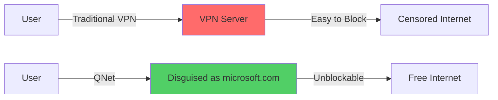

In countries with internet censorship:
- **VPNs are blocked** by detecting encrypted traffic patterns
- **Tor is slow** and can be blocked at the network level
- **Proxies are discovered** and added to blocklists

**QNet solves this** by making your traffic look exactly like legitimate HTTPS connections to trusted domains. To an ISP or government censor, you're just browsing Microsoft, Google, or Cloudflare—but you're actually accessing any site through a global P2P mesh network.

---

## 🎯 Why QNet?

### QNet vs. Traditional Solutions

| Feature | VPN | Tor | Proxy | **QNet** |
|---------|-----|-----|-------|----------|
| **Decentralized** | ❌ No | ✅ Yes | ❌ No | ✅ Yes |
| **Censorship Resistant** | ❌ Easy to block | ⚠️ Can be blocked | ❌ Easy to block | ✅ Unblockable |
| **Performance** | ✅ Fast | ❌ Slow | ✅ Fast | ✅ Fast |
| **Traffic Masking** | ❌ Obvious VPN pattern | ⚠️ Detectable | ❌ Detectable | ✅ Perfect disguise |
| **No Single Point of Failure** | ❌ Central servers | ✅ Distributed | ❌ Central proxy | ✅ P2P mesh |
| **Privacy** | ⚠️ Trust required | ✅ High | ❌ Low | ✅ High |

### Key Advantages

1. **🎭 Perfect Traffic Disguise (HTX Protocol)**
   - Clones TLS fingerprints of popular sites (JA3, ALPN, cipher suites)
   - Traffic analysis shows normal HTTPS to trusted domains
   - Impossible to distinguish from legitimate traffic without breaking TLS

2. **🕸️ Truly Decentralized**
   - No central servers to shut down
   - Every user strengthens the network
   - P2P mesh with DHT-based peer discovery

3. **⚡ Performance-Focused**
   - Fast Mode: 1-hop routing for maximum speed
   - Privacy Mode: 3-hop routing for anonymity
   - QUIC support for improved latency

4. **🔒 Defense-in-Depth Security**
   - ChaCha20-Poly1305 AEAD encryption
   - Noise XK protocol for forward secrecy
   - Ed25519 signatures for catalog integrity
   - Deterministic CBOR serialization

---

## 🏗️ Architecture Overview

QNet implements a **7-layer protocol stack** inspired by the OSI model, designed specifically for censorship resistance:

```mermaid
graph TB
    subgraph "QNet 7-Layer Architecture"
        L7[L7: Application<br/>Browser Extension + SOCKS5]
        L6[L6: Incentive Layer<br/>Vouchers & Reputation Future]
        L5[L5: Naming & Identity<br/>Self-Certifying IDs Future]
        L4[L4: Privacy Hops<br/>Mixnet Integration Optional]
        L3[L3: Overlay Mesh<br/>libp2p + DHT + Gossip]
        L2[L2: Cover Transport<br/>HTX + TLS Mirroring]
        L1[L1: Path Selection<br/>SCION-inspired Routing]
        L0[L0: Access Media<br/>TCP/UDP/QUIC over IP]
    end
    
    L7 --> L6
    L6 --> L5
    L5 --> L4
    L4 --> L3
    L3 --> L2
    L2 --> L1
    L1 --> L0
    
    style L2 fill:#ffd43b,stroke:#333,stroke-width:3px
    style L3 fill:#74c0fc,stroke:#333,stroke-width:3px
    style L7 fill:#b197fc,stroke:#333,stroke-width:3px
```

### Layer Responsibilities

| Layer | Component | Status | Description |
|-------|-----------|--------|-------------|
| **L7** | Application | ✅ Complete | `stealth-browser` Helper (SOCKS5 proxy) + Browser Extension UI |
| **L6** | Incentives | 🔮 Future | Payment vouchers, reputation system, resource accounting |
| **L5** | Naming | 🔮 Future | Decentralized identity, alias ledger, self-certifying names |
| **L4** | Privacy | 🔮 Future | Optional mixnet integration (Nym/Sphinx packets) for high anonymity |
| **L3** | Mesh | ✅ Complete | P2P networking via libp2p (mDNS, DHT, circuits, relay) - **Phase 2 done** |
| **L2** | Transport | ✅ Complete | **HTX protocol** - TLS fingerprint cloning + AEAD framing |
| **L1** | Routing | 📋 Deferred | Multi-path selection, path validation (SCION-inspired) - **Post-MVP** |
| **L0** | Physical | ✅ System | OS-provided TCP/UDP/QUIC bearers |

> **Note on L1 Routing**: SCION-inspired path-aware routing is architecturally fundamental for production (path validation, multi-path redundancy, geographic diversity). Currently deferred post-MVP to prioritize user delivery (Phase 3: Browser Extension). Current implementation relies on libp2p's built-in routing (L3) over standard IP (L0), which works but lacks the cryptographic path validation and explicit multi-path control that L1 will provide. **Planned for Phase 4** after extension deployment.

---

## 🚀 How It Works

### High-Level Flow

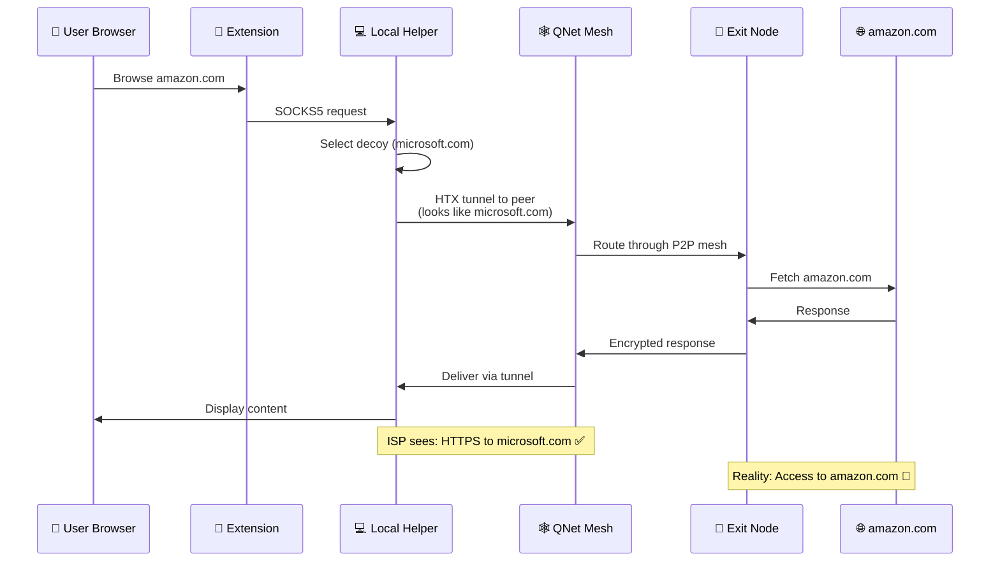

### Detailed Connection Flow

#### 1. **Bootstrap & Discovery**
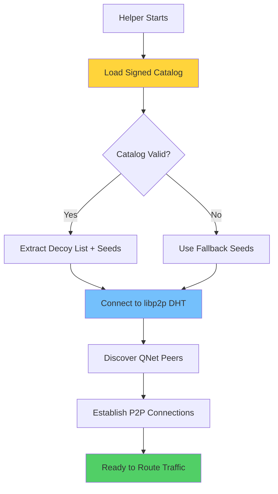

**Bootstrap Strategy:**
- **Primary**: Global libp2p DHT (IPFS infrastructure - free, battle-tested)
- **Secondary**: Operator seed nodes (small DigitalOcean droplets, $4-6/month)
- **Updates**: Signed catalog system for adding community nodes
- **Result**: Zero single point of failure

#### 2. **Traffic Masking (HTX Protocol)**

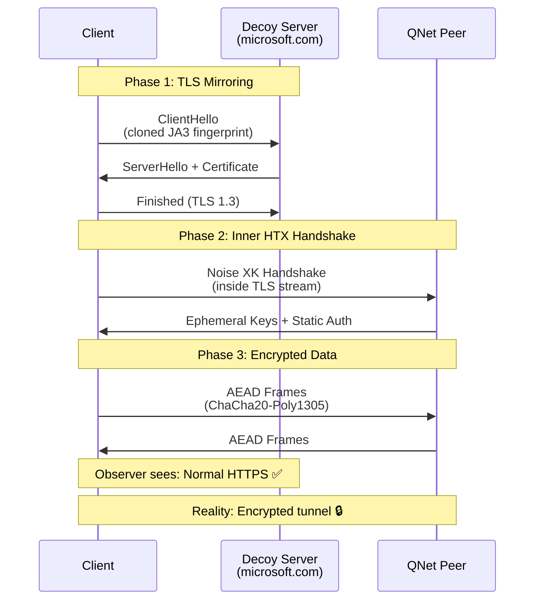

**HTX Security Properties:**
- **TLS Fingerprint Cloning**: JA3, ALPN, cipher suites match decoy exactly
- **Inner Noise XK**: Mutual authentication + ephemeral keys
- **AEAD Framing**: ChaCha20-Poly1305 with monotonic nonces
- **Forward Secrecy**: Keys rotate, no persistent state compromise
- **Integrity**: Ed25519 signatures on all config artifacts

#### 3. **Mesh Routing Modes**

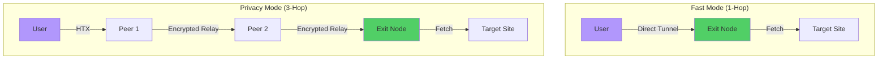

**Fast Mode**: Direct tunnel for maximum performance (default)
**Privacy Mode**: Multi-hop relay for stronger anonymity (optional)

#### 4. **Exit Node Architecture**

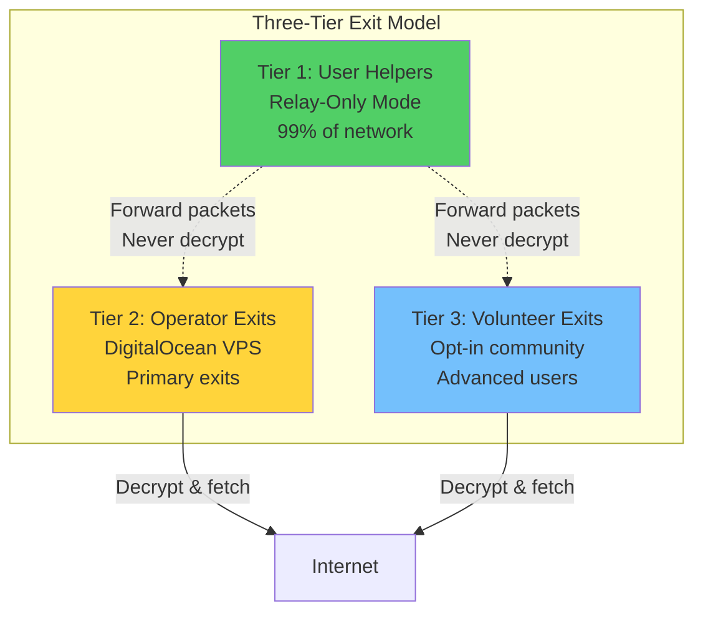

**Legal Protection Strategy:**
- **Tier 1 (Users)**: Relay-only, no legal risk (can't see content)
- **Tier 2 (Operator)**: Professional VPS with proper abuse policies
- **Tier 3 (Volunteers)**: Explicit opt-in with legal warnings

---

## ✨ Key Features

### 1. Perfect Traffic Disguise

**HTX (Hypertext Transport Extension)** is QNet's secret weapon:

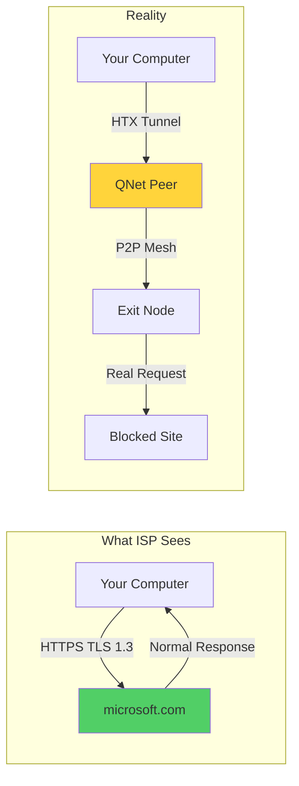

**Technical Implementation:**
- Clones TLS ClientHello fingerprint of decoy site
- Matches JA3, cipher suites, extensions, ALPN
- Traffic timing and padding profiles mimic real usage
- Inner Noise XK handshake provides actual encryption

### 2. Decentralized Peer Discovery

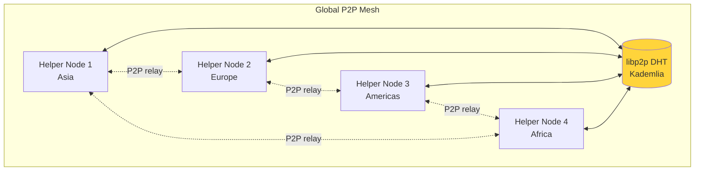

**No Central Servers:**
- Leverages existing IPFS/libp2p DHT infrastructure
- Fallback to operator seed nodes
- Catalog-based updates for community additions
- Resilient to regional blocking

### 3. Cryptographic Security

**Defense-in-Depth Approach:**

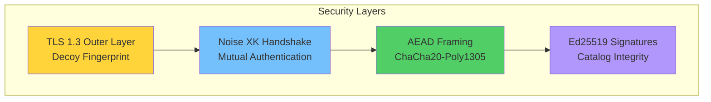

**Cryptographic Primitives:**
- **ChaCha20-Poly1305**: AEAD encryption (fast, secure)
- **Ed25519**: Signatures for catalog/config validation
- **X25519**: Ephemeral key exchange (Noise protocol)
- **HKDF-SHA256**: Key derivation

**Security Guarantees:**
- Forward secrecy (ephemeral keys)
- Message integrity (AEAD tags)
- Replay protection (monotonic nonces)
- Tamper detection (signed catalogs)

---

## 🔧 Technology Stack

### Core Technologies

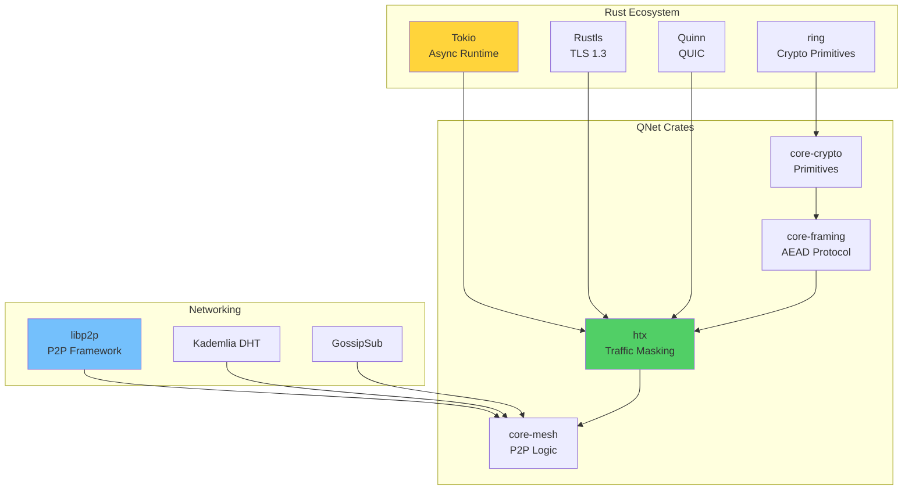

| Component | Technology | Reason |
|-----------|------------|--------|
| **Core Language** | Rust | Memory safety, performance, fearless concurrency |
| **Async Runtime** | Tokio | Industry-standard async I/O |
| **TLS/QUIC** | Rustls + Quinn | Modern, pure-Rust implementations |
| **P2P Networking** | libp2p | Battle-tested, modular, protocol-agnostic |
| **Cryptography** | ring, ed25519-dalek | Audited, fast, constant-time |
| **Serialization** | CBOR (serde_cbor) | Deterministic encoding for signatures |
| **UI** | WebExtensions API | Cross-browser (Chrome/Edge/Firefox) |

---

## 🛠️ Quick Start (Developers)

### Prerequisites

- **Rust 1.70+**: `rustup install stable`
- **Windows** (primary dev environment) or Linux/macOS
- **PowerShell** (for Windows scripts)

### Build & Run

```powershell
# 1. Clone the repository
git clone https://github.com/QW1CKS/qnet.git
cd qnet

# 2. Build all workspace crates
cargo build --workspace

# 3. Run the Helper (local SOCKS5 proxy)
cargo run -p stealth-browser

# The Helper will start on:
# - SOCKS5 proxy: 127.0.0.1:1088
# - Status API: 127.0.0.1:8088
```

### Verify Installation

```powershell
# Check Helper status
Invoke-WebRequest -Uri http://127.0.0.1:8088/status | ConvertFrom-Json

# Test masked connection (connect to wikipedia disguised as decoy)
pwsh ./scripts/test-masked-connect.ps1 -Target www.wikipedia.org

# Run full test suite
cargo test --workspace

# Run benchmarks (performance-critical crates)
cargo bench -p core-framing
cargo bench -p htx
```

### Development Tools

```powershell
# Format check
cargo fmt --check

# Linting (strict mode)
cargo clippy --workspace --all-targets -- -D warnings

# Fuzz testing (requires nightly)
cargo +nightly fuzz run framing_fuzz

# Spec validation (Go linter)
cd linter
go build -o qnet-lint ./cmd/qnet-lint
./qnet-lint validate ..
```

---

## 📁 Project Structure

```
qnet/
├── apps/                      # User-facing applications
│   ├── stealth-browser/       # 💻 Helper Node (SOCKS5 + status API)
│   └── edge-gateway/          # 🚪 Server-side exit node
│
├── crates/                    # Core Rust libraries
│   ├── htx/                   # 🎭 HTX protocol (TLS mirroring)
│   ├── core-framing/          # 📦 AEAD frame encoding/decoding
│   ├── core-crypto/           # 🔐 Cryptographic primitives
│   ├── core-mesh/             # 🕸️ P2P mesh networking (libp2p)
│   ├── core-routing/          # 🗺️ Path selection (future)
│   ├── core-mix/              # 🎲 Mixnet integration (future)
│   ├── alias-ledger/          # 📛 Decentralized naming (future)
│   ├── voucher/               # 💰 Payment system (future)
│   └── catalog-signer/        # ✍️ Catalog signing tool
│
├── qnet-spec/                 # Specification & governance
│   ├── specs/001-qnet/
│   │   ├── spec.md            # 📖 Protocol specification
│   │   ├── plan.md            # 🗺️ Strategic roadmap
│   │   └── tasks.md           # ✅ Unified task list
│   ├── memory/
│   │   ├── ai-guardrail.md    # 🤖 AI coding guidelines
│   │   └── testing-rules.md   # 🧪 Testing requirements
│   └── docs/                  # Component documentation
│
├── docs/                      # Architecture documentation
│   ├── ARCHITECTURE.md        # 🏗️ System architecture
│   ├── CONTRIBUTING.md        # 🤝 Contribution guide
│   └── helper.md              # 📚 Helper API reference
│
├── tests/                     # Integration tests
├── fuzz/                      # Fuzzing targets
├── scripts/                   # Automation scripts
└── artifacts/                 # Benchmarks & performance data
```

### Key Crates

| Crate | Purpose | Status |
|-------|---------|--------|
| `htx` | HTX protocol implementation (TLS mirroring + Noise) | ✅ Complete |
| `core-framing` | AEAD frame encoding (ChaCha20-Poly1305) | ✅ Complete |
| `core-crypto` | Cryptographic wrappers (Ed25519, X25519, HKDF) | ✅ Complete |
| `core-cbor` | Deterministic CBOR serialization | ✅ Complete |
| `core-mesh` | P2P networking via libp2p (mDNS, DHT, circuits) | ✅ Complete |
| `core-routing` | L1 multi-path routing (SCION-inspired) | 📋 Deferred |
| `core-mix` | Mixnet integration (Sphinx packets) | 🔮 Future |
| `alias-ledger` | Self-certifying identities | 🔮 Future |
| `voucher` | Micropayment vouchers | 🔮 Future |

---

## 🔒 Security Model

### Threat Model

QNet is designed to resist:

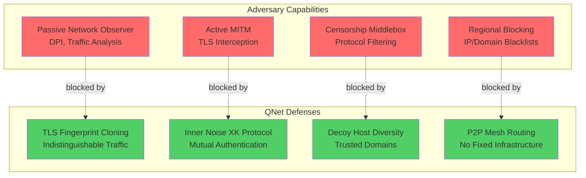

### Security Properties

| Property | Implementation | Verification |
|----------|----------------|--------------|
| **Confidentiality** | ChaCha20-Poly1305 AEAD | Constant-time crypto libs |
| **Integrity** | AEAD tags + Ed25519 signatures | Tamper-detection tests |
| **Forward Secrecy** | Ephemeral X25519 keys (Noise XK) | Key rotation tests |
| **Replay Protection** | Monotonic nonces | Nonce uniqueness tests |
| **Traffic Masking** | TLS fingerprint cloning | DPI capture validation |
| **Catalog Integrity** | Ed25519 + DET-CBOR | Signature verification tests |

### Security Best Practices


**Key Invariants:**
- All cryptographic operations use vetted libraries (`ring`, `ed25519-dalek`)
- No secret-dependent branching (constant-time guarantees)
- Nonce uniqueness enforced via monotonic counters
- Signed config objects validated before use
- Expired catalogs rejected with grace period

---

## ⚡ Performance

### Benchmarks

**Environment**: Intel Core i7, 16GB RAM, Windows 11

| Operation | Throughput | Latency |
|-----------|------------|---------|
| **HTX Handshake** | - | ~50ms (incl. TLS) |
| **AEAD Frame Encoding** | 2.5 GB/s | ~400 ns/frame |
| **AEAD Frame Decoding** | 2.3 GB/s | ~430 ns/frame |
| **Catalog Verification** | - | ~2ms (Ed25519) |
| **1-Hop Connection** | 80-120 Mbps | +5-15ms vs direct |
| **3-Hop Connection** | 40-80 Mbps | +20-50ms vs direct |

**Performance Optimization:**
- Zero-copy frame processing where possible
- Reusable buffer pools (no per-frame allocation)
- Vectorized crypto operations (SIMD when available)
- Connection multiplexing (reduce handshake overhead)

### Scalability

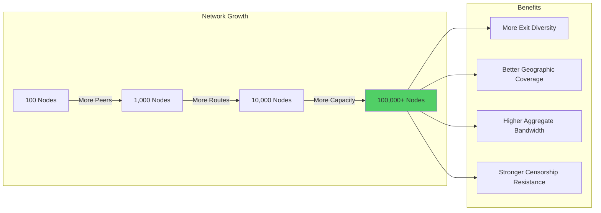

**Scalability Design:**
- DHT-based discovery (logarithmic routing)
- Gossip protocol for mesh updates (epidemic spread)
- Local routing tables (no global state)
- Lazy connection management (connect on-demand)

---

## 📚 Documentation

> [!WARNING]
> This documentation is a work in progress. Please refer to the [qnet-spec/](qnet-spec/) directory for the most up-to-date technical specifications and design documents.

### For Users
- **[Quick Start Guide](docs/QUICKSTART.md)** - Get running in 5 minutes
- **[Browser Extension Guide](qnet-spec/docs/extension.md)** - Using the UI
- **[Troubleshooting](docs/TROUBLESHOOTING.md)** - Common issues

### For Developers
- **[Architecture Overview](docs/ARCHITECTURE.md)** - System design
- **[Protocol Specification](qnet-spec/specs/001-qnet/spec.md)** - Wire format details
- **[Contributing Guide](docs/CONTRIBUTING.md)** - How to contribute
- **[Testing Rules](qnet-spec/memory/testing-rules.md)** - Test requirements
- **[AI Guardrails](qnet-spec/memory/ai-guardrail.md)** - AI coding standards

### For Operators
- **[Running an Exit Node](docs/EXIT_NODE.md)** - Deployment guide
- **[Catalog Management](docs/CATALOG.md)** - Signing & distribution
- **[Security Best Practices](SECURITY.md)** - Hardening guide

### Specification Documents
- **[Unified Task List](qnet-spec/specs/001-qnet/tasks.md)** - Development roadmap
- **[Strategic Plan](qnet-spec/specs/001-qnet/plan.md)** - Vision & phases
- **[Constitution](qnet-spec/specs/001-qnet/constitution.md)** - Governance principles

---

## 🤝 Contributing

We welcome contributions! QNet is building the future of internet freedom.

### How to Contribute


**Step-by-Step:**

1. **Find a Task**: Check [tasks.md](qnet-spec/specs/001-qnet/tasks.md) for open items
   - Look for Phase 2 (Helper development) or Phase 3 (User experience)
   - Comment on the task to claim it

2. **Set Up Environment**:
   ```powershell
   git clone https://github.com/QW1CKS/qnet.git
   cd qnet
   cargo build --workspace
   cargo test --workspace
   ```

3. **Development Workflow**:
   - Add/update tests first (test-driven development)
   - Implement minimal changes (trace to spec task)
   - Run checks: `cargo fmt`, `cargo clippy`, `cargo test`
   - Verify fuzz targets if touching parsers

4. **Commit Requirements**:
   ```
   Brief description of change

   - Detailed point 1
   - Detailed point 2

   Task: T3.2 (example)
   AI-Guardrail: PASS
   Testing-Rules: PASS
   ```

5. **Pull Request**:
   - Include spec/task references
   - Attach before/after benchmarks (if performance-sensitive)
   - Explain risk assessment
   - No unrelated refactors

### Contribution Areas

| Area | Skills | Difficulty |
|------|--------|------------|
| **HTX Protocol** | Rust, TLS, Cryptography | 🔴 Hard |
| **Mesh Networking** | Rust, libp2p, P2P | 🟡 Medium |
| **Helper/Extension** | Rust, JavaScript, UI | 🟢 Easy |
| **Testing** | Any language, QA mindset | 🟢 Easy |
| **Documentation** | Technical writing | 🟢 Easy |
| **Performance** | Profiling, optimization | 🟡 Medium |

### Code Standards

- **Language**: Idiomatic Rust (follow existing patterns)
- **Formatting**: `cargo fmt --check` (enforce)
- **Linting**: `cargo clippy` with `-D warnings`
- **Testing**: ≥80% coverage for critical paths
- **Security**: Follow [AI guardrails](qnet-spec/memory/ai-guardrail.md)

---

## 🗺️ Roadmap

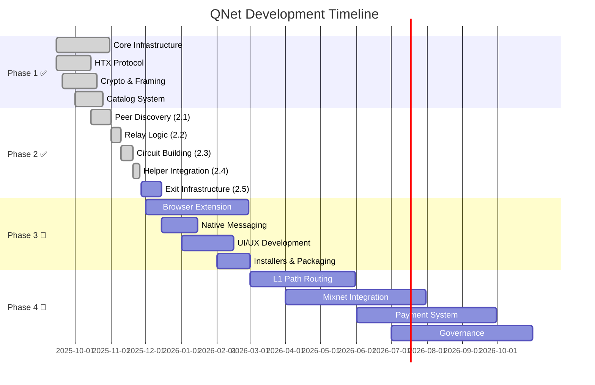

### Current Status: Phase 2 Core Complete (80%) → Phase 2.5 & 3 Next

**Phase 1: Core Infrastructure** (✅ 100% Complete - Sept 15 - Oct 31, 2025)
- ✅ HTX protocol implementation (`htx/`)
- ✅ AEAD framing layer (`core-framing/`)
- ✅ Cryptographic primitives (`core-crypto/`)
- ✅ Catalog signing system (`catalog-signer/`)
- ✅ Deterministic CBOR encoding (`core-cbor/`)

**Phase 2: P2P Mesh Network** (✅ 80% Complete - Oct 15 - Nov 26, 2025)

*Completed Sections (2.1-2.4):*
- ✅ **2.1 Peer Discovery** - mDNS local + Kademlia DHT + public IPFS bootstrap
- ✅ **2.2 Relay Logic** - Packet forwarding, routing table, statistics tracking  
- ✅ **2.3 Circuit Building** - Multi-hop circuits (max 3 hops), auto-teardown
- ✅ **2.4 Helper Integration** - SOCKS5→Mesh tunneling, status API, CLI modes

*Pending (2.5-2.6):*
- 🚧 **2.5 Infrastructure** - Exit node deployment scripts, bandwidth policies, operator droplets
- 📋 **2.6 Production Checkpoint** - Security audit, 24hr stability test, performance validation

**Phase 3: User Experience** (📋 0% - Starting Dec 2025)
- 📋 Browser extension UI (React/Preact)
- 📋 Native messaging bridge (Helper ↔ Extension)
- 📋 Cross-platform installers (Windows/Linux/macOS)
- 📋 User documentation & onboarding guides

**Phase 4: Advanced Features** (🔮 Future - Q2 2026+)
- 📋 L1 SCION-inspired path routing (cryptographic path validation)
- 📋 Mixnet privacy hops (Nym/Sphinx integration)
- 📋 Micropayment system (vouchers, relay incentives)
- 📋 Decentralized governance (voting, upgrades)
- 📋 Mobile support (Android/iOS apps)

---

## 📜 License

QNet is released under the **MIT License**.

```
MIT License

Copyright (c) 2024 QNet Contributors

Permission is hereby granted, free of charge, to any person obtaining a copy
of this software and associated documentation files (the "Software"), to deal
in the Software without restriction, including without limitation the rights
to use, copy, modify, merge, publish, distribute, sublicense, and/or sell
copies of the Software...
```

See [LICENSE](LICENSE) for full text.

---

## 🙏 Acknowledgments

QNet builds on the shoulders of giants:
- **Tor Project**: Pioneering anonymous communication
- **IPFS/libp2p**: Decentralized networking protocols
- **Rustls**: Modern TLS implementation
- **Nym**: Mixnet research and implementation
- **SCION**: Secure path-aware networking

---

## 📞 Contact & Community

- **GitHub Issues**: Bug reports and feature requests
- **Discussions**: Design discussions and Q&A
- **Security**: See [SECURITY.md](SECURITY.md) for responsible disclosure

---

<div align="center">
  <p><strong>Building the unblockable internet, one node at a time.</strong></p>
  <p>⭐ Star us on GitHub | 🍴 Fork and contribute | 📢 Spread the word</p>
</div>