# QNet: The Invisible Overlay Network

<div align="center">
  
  <p><strong>Decentralized. Censorship-Resistant. Unblockable.</strong></p>
</div>

---

> [!CAUTION]
> Most of the code has been implemented using agentic AI. This is just a side-project that I wanted to experiment with Copilot. This project was done purely for fun and learning. I will be removing the AI-generated code  and implement it manually in the future if I ever plan to make it production-ready. I know how frustrating it is to see AI slop in production code these days, and I very much understand the sentiment from a security perspective.
>
> If I ever intend to make this production-ready, I will make sure to undergo a professional security audit for this project.
>
> At the current moment, I make the AI follow strict [security guardrails](qnet-spec/memory/ai-guardrail.md) to ensure that the code is secure and follows best practices.
>
> Use at your own risk.

---

## Table of Contents
- [What is QNet?](#-what-is-qnet)
- [Why QNet?](#-why-qnet)
- [Architecture Overview](#-architecture-overview)
- [How It Works](#-how-it-works)
- [Key Features](#-key-features)
- [Technology Stack](#-technology-stack)
- [Quick Start](#-quick-start-developers)
- [Project Structure](#-project-structure)
- [Security Model](#-security-model)
- [Performance](#-performance)
- [Documentation](#-documentation)
- [Contributing](#-contributing)

---

## What is QNet?

QNet is a **next-generation decentralized overlay network** engineered to provide censorship-resistant, privacy-preserving internet access from anywhere in the world. Unlike traditional VPNs or proxies, QNet uses advanced traffic masking techniques to make your connections completely indistinguishable from normal HTTPS traffic to popular websites.

### The Core Problem We Solve

In countries with internet censorship:
- **VPNs are blocked** by detecting encrypted traffic patterns
- **Tor is slow** and can be blocked at the network level
- **Proxies are discovered** and added to blocklists

**QNet solves this** by making your traffic look exactly like legitimate HTTPS connections to trusted domains. To an ISP or government censor, you're just browsing Microsoft, Google, or Cloudflare—but you're actually accessing any site through a global P2P mesh network.

---

## Why QNet?

### QNet vs. Traditional Solutions

| Feature | VPN | Tor | Proxy | **QNet** |
|---------|-----|-----|-------|----------|
| **Decentralized** | No | Yes | No | **Yes** |
| **Censorship Resistant** | Easy to block | Can be blocked | Easy to block | **Unblockable** |
| **Performance** | Fast | Slow | Fast | **Fast** |
| **Traffic Masking** | Obvious VPN pattern | Detectable | Detectable | **Perfect disguise** |
| **No Single Point of Failure** | Central servers | Distributed | Central proxy | **P2P mesh** |
| **Privacy** | Trust required | High | Low | **High** |

### Key Advantages

1. **Perfect Traffic Disguise (HTX Protocol)**
   - Clones TLS fingerprints of popular sites (JA3, ALPN, cipher suites)
   - Traffic analysis shows normal HTTPS to trusted domains
   - Impossible to distinguish from legitimate traffic without breaking TLS

2. **Truly Decentralized**
   - No central servers to shut down
   - Every user strengthens the network
   - P2P mesh with operator directory for peer discovery

3. **Performance-Focused**
   - Fast Mode: 1-hop routing for maximum speed
   - Privacy Mode: 3-hop routing for anonymity
   - QUIC support for improved latency

4. **Defense-in-Depth Security**
   - ChaCha20-Poly1305 AEAD encryption
   - Noise XK protocol for forward secrecy
   - Ed25519 signatures for peer identity
   - Deterministic CBOR serialization

---

## Architecture Overview

QNet implements a **7-layer protocol stack** inspired by the OSI model, designed specifically for censorship resistance:

```mermaid
graph BT
    L0["L0: Access Media<br/>━━━━━━━━━━━━━<br/>TCP/UDP/QUIC over IP"]
    L1["L1: Path Selection<br/>━━━━━━━━━━━━━<br/>SCION-inspired Routing<br/>Deferred"]
    L2["L2: Cover Transport<br/>━━━━━━━━━━━━━<br/>HTX + TLS Mirroring<br/>Complete"]
    L3["L3: Overlay Mesh<br/>━━━━━━━━━━━━━<br/>libp2p + Directory + Gossip<br/>Complete"]
    L4["L4: Privacy Hops<br/>━━━━━━━━━━━━━<br/>Mixnet Integration Optional<br/>Future"]
    L5["L5: Naming & Identity<br/>━━━━━━━━━━━━━<br/>Self-Certifying IDs<br/>Future"]
    L6["L6: Incentive Layer<br/>━━━━━━━━━━━━━<br/>Vouchers & Reputation<br/>Future"]
    L7["L7: Application<br/>━━━━━━━━━━━━━<br/>Browser Extension + SOCKS5<br/>Complete"]
    
    L0 --> L1
    L1 --> L2
    L2 --> L3
    L3 --> L4
    L4 --> L5
    L5 --> L6
    L6 --> L7
    
    style L2 fill:#ffd43b,stroke:#333,stroke-width:3px
    style L3 fill:#74c0fc,stroke:#333,stroke-width:3px
    style L7 fill:#b197fc,stroke:#333,stroke-width:3px
```



### Layer Responsibilities

| Layer | Component | Status | Description |
|-------|-----------|--------|-------------|
| **L7** | Application | Complete | `stealth-browser` Helper (SOCKS5 proxy) + Browser Extension UI |
| **L6** | Incentives | Future | Payment vouchers, reputation system, resource accounting |
| **L5** | Naming | Future | Decentralized identity, alias ledger, self-certifying names |
| **L4** | Privacy | Future | Optional mixnet integration (Nym/Sphinx packets) for high anonymity |
| **L3** | Mesh | Complete | P2P networking via libp2p (mDNS, operator directory, circuits, relay) - **Phase 2 done** |
| **L2** | Transport | Complete | **HTX protocol** - TLS fingerprint cloning + AEAD framing |
| **L1** | Routing | Deferred | Multi-path selection, path validation (SCION-inspired) - **Post-MVP** |
| **L0** | Physical | System | OS-provided TCP/UDP/QUIC bearers |

> **Note on L1 Routing**: SCION-inspired path-aware routing is architecturally fundamental for production (path validation, multi-path redundancy, geographic diversity). Currently deferred post-MVP to prioritize user delivery (Phase 3: Browser Extension). Current implementation relies on libp2p's built-in routing (L3) over standard IP (L0), which works but lacks the cryptographic path validation and explicit multi-path control that L1 will provide. **Planned for Phase 4** after extension deployment.

---

## How It Works

### High-Level Flow


### HTX Handshake (TLS Fingerprint Cloning)


**HTX Security Properties:**
- **TLS Fingerprint Cloning**: JA3, ALPN, cipher suites match decoy exactly
- **Inner Noise XK**: Mutual authentication + ephemeral keys
- **AEAD Framing**: ChaCha20-Poly1305 with monotonic nonces
- **Forward Secrecy**: Keys rotate, no persistent state compromise
- **Integrity**: Ed25519 signatures on all config artifacts

### Mesh Routing Modes


**Fast Mode**: Direct tunnel for maximum performance (default)  
**Privacy Mode**: Multi-hop relay for stronger anonymity (optional)

#### 4. **Exit Node Architecture**


**Legal Protection Strategy:**
- **Tier 1 (Users)**: Relay-only, no legal risk (can't see content)
- **Tier 2 (Operator)**: Professional VPS with proper abuse policies
- **Tier 3 (Volunteers)**: Explicit opt-in with legal warnings

---

## Key Features

### 1. Perfect Traffic Disguise

**HTX (Hypertext Transport Extension)** is QNet's secret weapon:


**Technical Implementation:**
- Clones TLS ClientHello fingerprint to blend with normal traffic
- Matches JA3, cipher suites, extensions, ALPN of legitimate browsers
- Traffic timing and padding profiles mimic real usage patterns
- Inner Noise XK handshake provides actual encryption
- No single decoy—traffic blends naturally with HTTPS ecosystem

### 2. Decentralized Peer Discovery

> [!NOTE]
> **Current Status**: Peer discovery uses operator directory HTTP queries. Relay nodes register with operator nodes via heartbeat (30s interval). Client nodes query directory on startup to discover available relays. Local mDNS discovery works for same-network peers.

```mermaid
graph TB
    %% Tier 1: User Nodes (Client Mode) - 99% of network
    subgraph clients["🖥️ Tier 1: User Nodes (Client Mode)"]
        direction LR
        UC1["User Client 1<br/>─────────────<br/>• Mode: Client<br/>• SOCKS5: 127.0.0.1:1088<br/>• Status: 127.0.0.1:8088<br/>• Discovery: Query directory<br/>• Visibility: Invisible"]
        UC2["User Client 2<br/>─────────────<br/>• Mode: Client<br/>• Local peer only<br/>• Max privacy"]
        UC3["User Client N<br/>─────────────<br/>• Mode: Client<br/>• 99% of network"]
    end
    
    %% Tier 2: Community Relays (Optional)
    subgraph relays["🔄 Tier 2: Community Relays (Optional)"]
        direction LR
        REL1["Relay Node 1<br/>─────────────<br/>• Mode: Relay<br/>• Registers via heartbeat<br/>• Forwards encrypted packets<br/>• Country: US<br/>• No legal risk"]
        REL2["Relay Node 2<br/>─────────────<br/>• Mode: Relay<br/>• Community contributor<br/>• Country: EU"]
    end
    
    %% Tier 3: Operator Infrastructure (Super Mode)
    subgraph operators["🌐 Tier 3: Operator Infrastructure (Super Mode)"]
        direction TB
        DIR["📋 Directory Service<br/>─────────────<br/>POST /api/relay/register<br/>GET /api/relays/by-country<br/>GET /api/relays/prune<br/>─────────────<br/>• Country indexing<br/>• 120s TTL<br/>• 60s pruning"]
        
        subgraph super["Super Peers (Bootstrap + Relay + Exit)"]
            direction LR
            SUPER1["Super Peer 1 (NYC)<br/>─────────────<br/>• Mode: Super<br/>• Bootstrap: Yes<br/>• Relay: Yes<br/>• Exit: Yes<br/>• IP: 64.23.xxx.xxx"]
            SUPER2["Super Peer 2 (AMS)<br/>─────────────<br/>• Mode: Super<br/>• All features<br/>• IP: 159.89.xxx.xxx"]
            SUPER3["Super Peer 3 (SGP)<br/>─────────────<br/>• Mode: Super<br/>• All features<br/>• IP: 178.128.xxx.xxx"]
        end
        
        subgraph exits["Dedicated Exit Nodes"]
            direction LR
            EXIT1["Exit Node 1<br/>─────────────<br/>• Mode: Exit<br/>• HTTP/HTTPS only<br/>• Ports: 80, 443<br/>• SSRF prevention<br/>• Rate limiting"]
            EXIT2["Exit Node 2<br/>─────────────<br/>• Mode: Exit<br/>• Dedicated gateway<br/>• Country: US"]
        end
    end
    
    %% Internet
    WEB["🌍 Internet<br/>(HTTP/HTTPS)"]
    
    %% User connections to directory (discovery)
    UC1 -.->|"Query directory<br/>(on startup)"| DIR
    UC2 -.->|"Query directory"| DIR
    UC3 -.->|"Query directory"| DIR
    
    %% Relay registration (heartbeat)
    REL1 ==>|"Heartbeat POST<br/>(every 30s)"| DIR
    REL2 ==>|"Heartbeat POST"| DIR
    
    %% Super peer self-registration
    SUPER1 ==>|"Heartbeat"| DIR
    SUPER2 ==>|"Heartbeat"| DIR
    SUPER3 ==>|"Heartbeat"| DIR
    EXIT1 ==>|"Heartbeat"| DIR
    EXIT2 ==>|"Heartbeat"| DIR
    
    %% Mesh connectivity (encrypted relay)
    UC1 <-->|"HTX encrypted packets"| REL1
    UC1 <-->|"HTX encrypted packets"| SUPER1
    UC2 <-->|"HTX encrypted packets"| REL2
    UC2 <-->|"HTX encrypted packets"| SUPER2
    
    REL1 <-->|"Relay forwarding"| SUPER1
    REL2 <-->|"Relay forwarding"| SUPER2
    
    %% Exit traffic to internet
    SUPER1 -->|"Exit to internet"| WEB
    SUPER2 -->|"Exit to internet"| WEB
    EXIT1 -->|"Exit to internet"| WEB
    EXIT2 -->|"Exit to internet"| WEB
    
    %% Styling
    style UC1 fill:#b2f2bb,stroke:#51cf66,stroke-width:2px
    style UC2 fill:#b2f2bb,stroke:#51cf66,stroke-width:2px
    style UC3 fill:#b2f2bb,stroke:#51cf66,stroke-width:2px
    style REL1 fill:#a5d8ff,stroke:#74c0fc,stroke-width:2px
    style REL2 fill:#a5d8ff,stroke:#74c0fc,stroke-width:2px
    style DIR fill:#ffe066,stroke:#ffd43b,stroke-width:3px
    style SUPER1 fill:#d0bfff,stroke:#b197fc,stroke-width:3px
    style SUPER2 fill:#d0bfff,stroke:#b197fc,stroke-width:3px
    style SUPER3 fill:#d0bfff,stroke:#b197fc,stroke-width:3px
    style EXIT1 fill:#ffa8a8,stroke:#ff6b6b,stroke-width:2px
    style EXIT2 fill:#ffa8a8,stroke:#ff6b6b,stroke-width:2px
    style WEB fill:#e9ecef,stroke:#868e96,stroke-width:2px
```



**Key Flows:**

**Discovery Flow** (Client Startup):
1. Client starts → Queries directory (`GET /api/relays/by-country?country=US`)
2. Directory returns peer list (relays, super peers, exit nodes)
3. Client dials discovered peers via HTX encrypted tunnel
4. Connection established, ready to route traffic

**Heartbeat Flow** (Relay Registration):
1. Relay/Exit/Super node starts
2. Sends `POST /api/relay/register` every 30 seconds
3. Peer appears in directory query results
4. If heartbeat stops, peer pruned after 120s TTL

**Data Flow** (User Traffic):
1. User browser → SOCKS5 proxy (127.0.0.1:1088)
2. Helper establishes HTX tunnel (encrypted, fingerprint-cloned TLS)
3. P2P mesh routing (1-3 hops through relays/super peers)
4. Exit node decrypts and forwards to real HTTP/HTTPS destination
5. Response returns through same path (bidirectional)

**Network Architecture Components:**

**Tier 1 - User Nodes (Client Mode):**
- 99% of network population
- Query directory on startup for peer discovery
- Never register (invisible to operators)
- Highest privacy level
- SOCKS5 proxy for browser integration
- Local status API for monitoring

**Tier 2 - Community Relays (Relay Mode):**
- Optional contributors increasing network capacity
- Register via heartbeat (30s interval)
- Forward encrypted packets only (never decrypt)
- No legal liability (can't see content)
- Country-tagged for geographic routing
- Safe default for community participation

**Tier 3 - Operator Infrastructure:**
- **Super Peers**: 6 DigitalOcean droplets (bootstrap + relay + exit)
  - NYC, Amsterdam, Singapore, London, San Francisco, Toronto
  - Run directory service (HTTP registry)
  - Provide fallback relay capacity
  - Primary exit nodes (legal liability accepted)
  
- **Directory Service**: HTTP registry for peer discovery
  - POST /api/relay/register (relay registration)
  - GET /api/relays/by-country?country=US (query with filter)
  - GET /api/relays/prune (manual pruning, admin only)
  - 120s TTL per peer (automatic staleness detection)
  - 60s pruning interval (background task)
  - Country indexing for geographic routing
  
- **Exit Nodes**: Internet gateways (exit/super mode)
  - HTTP/HTTPS only (ports 80, 443)
  - SSRF prevention (block private IPs)
  - Rate limiting (requests per minute)
  - Abuse logging (sanitized, no PII)
  - Professional VPS with proper abuse policies

**Discovery Flow:**
1. Client starts → Query operator directory (GET /api/relays/by-country)
2. Receive peer list (JSON: peer_id, multiaddrs, country, capabilities)
3. Dial discovered peers via libp2p
4. Establish HTX tunnels for mesh routing
5. <2s total discovery time (vs 90s DHT timeout)

**Heartbeat Flow:**
1. Relay starts → POST /api/relay/register (initial registration)
2. Timer: Send heartbeat every 30 seconds
3. Operator directory updates last_seen timestamp
4. If no heartbeat for 120s → Mark stale
5. Background pruning task removes stale peers every 60s

**Data Flow (HTX Cover Transport):**
1. User browser → SOCKS5 proxy (127.0.0.1:1088)
2. Helper encrypts with HTX (looks like HTTPS to trusted domain)
3. Route through P2P mesh (1-3 hops, encrypted per hop)
4. Exit node decrypts HTX tunnel
5. Make real HTTP/HTTPS request to target site
6. Response flows back through same circuit

**Key Security Properties:**
- **Client Privacy**: Never register, query-only, invisible to operators
- **Relay Safety**: Forward encrypted packets, no content visibility
- **Exit Isolation**: Only super/exit modes handle plaintext traffic
- **Geographic Diversity**: 6 operator nodes across 6 countries
- **Censorship Resistance**: HTX makes traffic look like normal HTTPS

### Operator Peer Directory

QNet uses a hybrid approach balancing centralized discovery with decentralized operation:

- **Discovery**: 6 operator nodes maintain relay peer directory (HTTP registry)
- **Operation**: Relay peers forward encrypted packets (fully P2P, no central control)
- **Registration**: Relay peers POST heartbeat every 30 seconds to stay listed
- **Query**: Clients retrieve peer list on startup (<200ms, no 90s DHT timeout)
- **Privacy**: Only country-level aggregation, no individual IP tracking
- **Fallback**: Direct connection to operator exits if directory unavailable

**Why not DHT?**
- Instant connections (no 90s bootstrap timeout)
- Predictable performance (no NAT traversal issues)
- Geographic routing (select relay by country)
- **Precedent**: Tor (9 directory authorities), Bitcoin (DNS seeds), IPFS (Protocol Labs bootnodes) all use operator seeds for discovery

**Key Distinction**: Discovery mechanism ≠ network centralization. Relay operation remains fully P2P with end-to-end encryption.

### 3. Cryptographic Security

**Defense-in-Depth Approach:**


**Cryptographic Primitives:**
- **ChaCha20-Poly1305**: AEAD encryption (fast, secure)
- **Ed25519**: Signatures for peer identity validation
- **X25519**: Ephemeral key exchange (Noise protocol)
- **HKDF-SHA256**: Key derivation

**Security Guarantees:**
- Forward secrecy (ephemeral keys)
- Message integrity (AEAD tags)
- Replay protection (monotonic nonces)
- Tamper detection (AEAD integrity)

---

## Technology Stack

### Core Technologies


| Component | Technology | Reason |
|-----------|------------|--------|
| **Core Language** | Rust | Memory safety, performance, fearless concurrency |
| **Async Runtime** | Tokio | Industry-standard async I/O |
| **TLS/QUIC** | Rustls + Quinn | Modern, pure-Rust implementations |
| **P2P Networking** | libp2p | Battle-tested, modular, protocol-agnostic |
| **Cryptography** | ring, ed25519-dalek | Audited, fast, constant-time |
| **Serialization** | CBOR (serde_cbor) | Deterministic encoding for signatures |
| **UI** | WebExtensions API | Cross-browser (Chrome/Edge/Firefox) |

---

## Quick Start (Developers)

### Prerequisites

- **Rust 1.70+**: `rustup install stable`
- **Windows** (primary dev environment) or Linux/macOS
- **PowerShell** (for Windows scripts)

### Understanding QNet Peer Modes

QNet uses a **3-tier architecture** with different operational modes for different roles:

#### Peer Mode Comparison

| Feature | Client | Relay | Bootstrap | Exit | Super |
|---------|--------|-------|-----------|------|-------|
| **Query directory on startup** | Yes | Yes | No | Yes | Yes |
| **Register with directory** | No | Yes | No | Yes | Yes |
| **Run directory service** | No | No | Yes | No | Yes |
| **Relay encrypted traffic** | Yes | Yes | Yes | Yes | Yes |
| **Exit to internet** | No | No | No | Yes | Yes |
| **Legal liability** | None | None | None | **Yes** | **Yes** |
| **Privacy level** | **Highest** | Medium | Medium | Medium | Medium |
| **Operator visibility** | Invisible | Visible | Visible | Visible | Visible |
| **Typical deployment** | User devices | Trusted relays | Operator droplets | Exit relays | Operator droplets |

#### Mode Details

**Client Mode** (default for end-users)
- **Purpose**: Maximum privacy for everyday users
- **Behavior**: Queries directory to find relays, connects through mesh, never registers
- **Privacy**: Operators cannot track individual users (no heartbeat = invisible)
- **Usage**: 
  ```powershell
  # Default mode (no flag needed)
  cargo run -p stealth-browser
  
  # Explicit
  cargo run -p stealth-browser -- --helper-mode client
  STEALTH_MODE=client cargo run -p stealth-browser
  ```

**Relay Mode** (community contributors)
- **Purpose**: Increase network capacity without legal risk
- **Behavior**: Registers with directory, forwards encrypted packets, never decrypts
- **Legal**: Safe - relay nodes only forward encrypted data (no content visibility)
- **Usage**:
  ```powershell
  cargo run -p stealth-browser -- --helper-mode relay
  STEALTH_MODE=relay cargo run -p stealth-browser
  ```

**Bootstrap Mode** (operator directory servers)
- **Purpose**: Run directory service for peer discovery
- **Behavior**: Hosts HTTP endpoints (`/api/relay/register`, `/api/relays/by-country`)
- **Infrastructure**: 6 global DigitalOcean droplets (geographically distributed)
- **Usage**:
  ```powershell
  cargo run -p stealth-browser -- --helper-mode bootstrap
  STEALTH_MODE=bootstrap cargo run -p stealth-browser
  ```

**Exit Mode** (dedicated exit nodes)
- **Purpose**: Internet gateway for mesh traffic
- **Behavior**: Relay + exit to public internet (decrypt HTTPS CONNECT requests)
- **Legal**: WARNING **High liability** - operator responsible for traffic from exit IP
- **Security**: Port filtering (80/443 only), SSRF prevention, rate limiting
- **Usage**:
  ```powershell
  cargo run -p stealth-browser -- --helper-mode exit
  STEALTH_MODE=exit cargo run -p stealth-browser
  ```

**Super Mode** (all-in-one operator nodes)
- **Purpose**: Combined bootstrap + relay + exit (maximum functionality)
- **Deployment**: The **6 operator droplets** run in super mode
- **Features**: All capabilities enabled simultaneously
- **Usage**:
  ```powershell
  cargo run -p stealth-browser -- --helper-mode super
  STEALTH_MODE=super cargo run -p stealth-browser
  ```

#### Network Architecture


**Key Design Principles:**

1. **Privacy by Default**: Client mode never registers (invisible to operators)
2. **Scalability**: 6 super peers can serve thousands of clients
3. **Legal Clarity**: Only operator droplets have exit liability (known, controlled IPs)
4. **Community Growth**: Relay mode allows contributions without legal risk
5. **Flexible Deployment**: Modes can be mixed/matched per network needs

**Environment Variables:**
```bash
STEALTH_MODE=client|relay|bootstrap|exit|super  # Override mode
STEALTH_SOCKS_PORT=1088                         # SOCKS5 port
STEALTH_STATUS_PORT=8088                        # Status API port
EXIT_ABUSE_EMAIL=abuse@example.com              # Required for exit/super
EXIT_MAX_CONNECTIONS=1000                       # Exit rate limit
```

### Build & Run

```powershell
# 1. Clone the repository
git clone https://github.com/QW1CKS/qnet.git
cd qnet

# 2. Build all workspace crates
cargo build --workspace

# 3. Run the Helper (local SOCKS5 proxy)
cargo run -p stealth-browser

# The Helper will start on:
# - SOCKS5 proxy: 127.0.0.1:1088
# - Status API: 127.0.0.1:8088
```

### Status State Transitions

The Helper's status page (`http://127.0.0.1:8088/`) displays the connection state with visual indicators:

- **Offline** (red): Initial state when bootstrap is disabled or no peers
- **Calibrating** (orange): Bootstrap enabled but not yet connected
- **Connected** (green): Mesh network ready OR successful SOCKS5 traffic

**State Transition Triggers:**
```
Offline → Connected:
  - Any mesh peer discovered (mDNS, operator directory, or bootstrap nodes)
  - Successful SOCKS5 connection established

Calibrating → Connected:
  - Same triggers as Offline → Connected
```

**Peer Discovery:**
- **Local network (mDNS)**: Discovers other QNet Helpers on same WiFi (~5 seconds)
- **Internet (Directory)**: Queries operator nodes for relay peers (~2 seconds, returns all registered relays)
- Status page shows `mesh_peer_count` and updates every 5 seconds

### Verify Installation

```powershell
# Check Helper status
Invoke-WebRequest -Uri http://127.0.0.1:8088/status | ConvertFrom-Json

# Test masked connection (any target site disguised via decoy)
pwsh ./scripts/test-masked-connect.ps1 -Target example.com

# Run full test suite
cargo test --workspace

# Run benchmarks (performance-critical crates)
cargo bench -p core-framing
cargo bench -p htx
```

### Development Tools

```powershell
# Format check
cargo fmt --check

# Linting (strict mode)
cargo clippy --workspace --all-targets -- -D warnings

# Fuzz testing (requires nightly)
cargo +nightly fuzz run framing_fuzz

# Spec validation (Go linter)
cd linter
go build -o qnet-lint ./cmd/qnet-lint
./qnet-lint validate ..
```

---

## 📁 Project Structure

```
qnet/
├── apps/                      # User-facing applications
│   ├── stealth-browser/       # Helper Node (SOCKS5 + status API)
│   └── edge-gateway/          # Server-side exit node
│
├── crates/                   # Core libraries
│   ├── htx/                   # HTX protocol (TLS tunneling)
│   ├── core-framing/          # AEAD frame codec
│   ├── core-crypto/           # Cryptographic primitives
│   ├── core-mesh/             # P2P mesh networking (libp2p)
│   ├── core-routing/          # Path selection (future)
│   ├── core-mix/              # Mixnet integration (future)
│   ├── alias-ledger/          # Decentralized naming (future)
│   └── voucher/               # Payment system (future)
│
├── qnet-spec/                 # Specification & governance
│   ├── specs/001-qnet/
│   │   ├── spec.md            # Protocol specification
│   │   ├── plan.md            #  Strategic roadmap
│   │   └── tasks.md           #  Unified task list
│   ├── memory/
│   │   ├── ai-guardrail.md    #  AI coding guidelines
│   │   └── testing-rules.md   #  Testing requirements
│   └── docs/                  # Component documentation
│
├── docs/                      # Architecture documentation
│   ├── ARCHITECTURE.md        # System architecture
│   ├── CONTRIBUTING.md        # Contribution guide
│   └── helper.md              # Helper API reference
│
├── tests/                     # Integration tests
├── fuzz/                      # Fuzzing targets
├── scripts/                   # Automation scripts
└── artifacts/                 # Benchmarks & performance data
```

### Key Crates

| Crate | Purpose | Status |
|-------|---------|--------|
| `htx` | HTX protocol implementation (TLS mirroring + Noise) | Complete |
| `core-framing` | AEAD frame encoding (ChaCha20-Poly1305) | Complete |
| `core-crypto` | Cryptographic wrappers (Ed25519, X25519, HKDF) | Complete |
| `core-cbor` | Deterministic CBOR serialization | Complete |
| `core-mesh` | P2P networking via libp2p (mDNS, DHT, circuits) | Complete |
| `core-routing` | L1 multi-path routing (SCION-inspired) | Deferred |
| `core-mix` | Mixnet integration (Sphinx packets) | Future |
| `alias-ledger` | Self-certifying identities | Future |
| `voucher` | Micropayment vouchers | Future |

---

## Security Model

### Threat Model

QNet is designed to resist:


### Security Properties

| Property | Implementation | Verification |
|----------|----------------|--------------|
| **Confidentiality** | ChaCha20-Poly1305 AEAD | Constant-time crypto libs |
| **Integrity** | AEAD tags + Ed25519 signatures | Tamper-detection tests |
| **Forward Secrecy** | Ephemeral X25519 keys (Noise XK) | Key rotation tests |
| **Replay Protection** | Monotonic nonces | Nonce uniqueness tests |
| **Traffic Masking** | TLS fingerprint cloning | DPI capture validation |

### Security Best Practices

**Key Invariants:**
- All cryptographic operations use vetted libraries (`ring`, `ed25519-dalek`)
- No secret-dependent branching (constant-time guarantees)
- Nonce uniqueness enforced via monotonic counters
- Signed config objects validated before use
- Peer identity verification required for handshake

---

## Performance

### Benchmarks

**Environment**: Intel Core i7, 16GB RAM, Windows 11

| Operation | Throughput | Latency |
|-----------|------------|---------|
| **HTX Handshake** | - | ~50ms (incl. TLS) |
| **AEAD Frame Encoding** | 2.5 GB/s | ~400 ns/frame |
| **AEAD Frame Decoding** | 2.3 GB/s | ~430 ns/frame |
| **1-Hop Connection** | 80-120 Mbps | +5-15ms vs direct |
| **3-Hop Connection** | 40-80 Mbps | +20-50ms vs direct |

**Performance Optimization:**
- Zero-copy frame processing where possible
- Reusable buffer pools (no per-frame allocation)
- Vectorized crypto operations (SIMD when available)
- Connection multiplexing (reduce handshake overhead)

### Scalability


**Scalability Design:**
- DHT-based discovery (logarithmic routing)
- Gossip protocol for mesh updates (epidemic spread)
- Local routing tables (no global state)
- Lazy connection management (connect on-demand)

---

## Documentation

> [!WARNING]
> This documentation is a work in progress. Please refer to the [qnet-spec/](qnet-spec/) directory for the most up-to-date technical specifications and design documents.

### For Users
- **[Quick Start Guide](docs/QUICKSTART.md)** - Get running in 5 minutes
- **[Browser Extension Guide](qnet-spec/docs/extension.md)** - Using the UI
- **[Troubleshooting](docs/TROUBLESHOOTING.md)** - Common issues

### For Developers
- **[Architecture Overview](docs/ARCHITECTURE.md)** - System design
- **[Protocol Specification](qnet-spec/specs/001-qnet/spec.md)** - Wire format details
- **[Contributing Guide](docs/CONTRIBUTING.md)** - How to contribute
- **[Testing Rules](qnet-spec/memory/testing-rules.md)** - Test requirements
- **[AI Guardrails](qnet-spec/memory/ai-guardrail.md)** - AI coding standards

### For Operators
- **[Running an Exit Node](docs/EXIT_NODE.md)** - Deployment guide
- **[Security Best Practices](SECURITY.md)** - Hardening guide

### Specification Documents
- **[Unified Task List](qnet-spec/specs/001-qnet/tasks.md)** - Development roadmap
- **[Strategic Plan](qnet-spec/specs/001-qnet/plan.md)** - Vision & phases
- **[Constitution](qnet-spec/specs/001-qnet/constitution.md)** - Governance principles

---

## Contributing

We welcome contributions! QNet is building the future of internet freedom.

### How to Contribute

**Step-by-Step:**

1. **Find a Task**: Check [tasks.md](qnet-spec/specs/001-qnet/tasks.md) for open items
   - Look for Phase 2 (Helper development) or Phase 3 (User experience)
   - Comment on the task to claim it

2. **Set Up Environment**:
   ```powershell
   git clone https://github.com/QW1CKS/qnet.git
   cd qnet
   cargo build --workspace
   cargo test --workspace
   ```

3. **Development Workflow**:
   - Add/update tests first (test-driven development)
   - Implement minimal changes (trace to spec task)
   - Run checks: `cargo fmt`, `cargo clippy`, `cargo test`
   - Verify fuzz targets if touching parsers

4. **Commit Requirements**:
   ```
   Brief description of change

   - Detailed point 1
   - Detailed point 2

   Task: T3.2 (example)
   AI-Guardrail: PASS
   Testing-Rules: PASS
   ```

5. **Pull Request**:
   - Include spec/task references
   - Attach before/after benchmarks (if performance-sensitive)
   - Explain risk assessment
   - No unrelated refactors

### Contribution Areas

| Area | Skills | Difficulty |
|------|--------|------------|
| **HTX Protocol** | Rust, TLS, Cryptography | Hard |
| **Mesh Networking** | Rust, libp2p, P2P | Medium |
| **Helper/Extension** | Rust, JavaScript, UI | Easy |
| **Testing** | Any language, QA mindset | Easy |
| **Documentation** | Technical writing | Easy |
| **Performance** | Profiling, optimization | Medium |

### Code Standards

- **Language**: Idiomatic Rust (follow existing patterns)
- **Formatting**: `cargo fmt --check` (enforce)
- **Linting**: `cargo clippy` with `-D warnings`
- **Testing**: ≥80% coverage for critical paths
- **Security**: Follow [AI guardrails](qnet-spec/memory/ai-guardrail.md)

---

## Roadmap


### Current Status: Phase 2.1.11 - Super Peer Implementation (In Progress)

> [!NOTE]
> **Multi-Mode Helper (Nov 30, 2025)**: Implemented 5 operational modes (client, relay, bootstrap, exit, super) with conditional feature enablement. Directory endpoints, heartbeat registration, and exit capabilities now respect helper mode configuration. 4 of 6 subtasks complete.

**Quick Summary:**

- **Phase 1 Complete** (Sept 15 - Oct 31, 2025): Core infrastructure ready
  - HTX protocol (TLS fingerprint cloning + Noise XK handshake)
  - AEAD framing layer (ChaCha20-Poly1305)
  - Cryptographic primitives (Ed25519, X25519, HKDF)
  - Deterministic CBOR encoding
  
- **Phase 2.1-2.4 Complete** (Oct 15 - Nov 27, 2025): P2P mesh operational
  - Peer discovery (mDNS + operator directory, DHT removed)
  - Relay logic (circuit-based packet forwarding)
  - Circuit building (multi-hop routing, 1-3 hops)
  - Helper integration (SOCKS5 proxy, status API, libp2p Circuit Relay V2)

-  **Phase 2.1.11 In Progress** (Nov 20 - Nov 30, 2025): Super peer mode - **67% complete (4 of 6 subtasks)**
  -  Directory HTTP endpoints (POST register, GET by-country, GET prune)
  -  Exit node logic (7 modules, 20 unit tests, SSRF prevention)
  -  5-mode system (client, relay, bootstrap, exit, super)
  -  Directory integration (conditional endpoints, background pruning)
  -  Exit node integration (SOCKS5 pipeline, stats tracking) - **NEXT**
  -  End-to-end testing (local super peer validation)

-  **Phase 3 Starting** (Dec 2025 - Feb 2026): User experience
  - Browser extension UI (WebExtensions Manifest V3)
  - Native messaging bridge (extension ↔ helper)
  - Cross-platform installers (Windows/Linux/macOS)
  - User documentation & onboarding

 **For detailed task breakdown**, see **[tasks.md](qnet-spec/specs/001-qnet/tasks.md)**

---

## Phase Completion Details

<details>
<summary><b>Phase 1: Core Infrastructure</b> ( 100% Complete)</summary>

-  **HTX Protocol Implementation** (`htx/` crate)
  - TLS 1.3 fingerprint mirroring (ClientHello templates from real browsers)
  - Origin-aware handshake (mimic target site's TLS characteristics)
  - Noise XK handshake derivative (Ed25519 static key verification)
  - Ephemeral X25519 key exchange (forward secrecy per connection)
  - ChaCha20-Poly1305 AEAD for post-handshake encryption
  - HKDF-SHA256 key derivation (traffic keys, rekey mechanism)
  - Deterministic nonce generation (monotonic counters, never reuse)
  - Integration tests with localhost TLS server (`certs/target3/`)
  
-  **AEAD Framing Layer** (`core-framing/` crate)
  - ChaCha20-Poly1305 AEAD per frame (integrity + confidentiality)
  - Length-prefixed frames (u16 header, max 16KB payload)
  - Monotonic nonce counters (per encoder/decoder instance)
  - Frame encoder/decoder API (stateful, reusable)
  - Bidirectional streaming support (concurrent read/write)
  - Fuzz targets (`fuzz/fuzz_targets/framing_fuzz.rs`)
  - Criterion benchmarks (throughput: ~1.2 GB/s on modern CPU)
  
-  **Cryptographic Primitives** (`core-crypto/` crate)
  - Ed25519 signatures (identity, catalog signing)
  - X25519 ECDH (ephemeral key exchange)
  - ChaCha20-Poly1305 AEAD (symmetric encryption)
  - HKDF-SHA256 (key derivation function)
  - BLAKE3 hashing (fast, parallelizable)
  - Wrappers around `ring` crate (constant-time, audited)
  - No raw crypto calls outside this crate (centralized, auditable)
  
- NO **Catalog System** (removed Oct 25, 2025 - replaced by hardcoded bootstrap)
  - Originally: Signed JSON catalog with decoy sites + operator nodes
  - DET-CBOR canonical encoding (for Ed25519 signature verification)
  - Expiration TTL with grace period (staleness detection)
  - Version monotonicity (prevent rollback attacks)
  - Decision: Removed due to operational complexity for MVP
  - Replacement: Hardcoded operator nodes in `core-mesh::discovery::load_bootstrap_nodes()`
  - Future: May revive for auto-update mechanism (Phase 3.4)
  
-  **Deterministic CBOR Encoding** (`core-cbor/` crate)
  - DET-CBOR implementation (RFC 8949 + deterministic rules)
  - Canonical ordering (map keys sorted lexicographically)
  - Used for signed payloads (catalog was primary use case)
  - No ambiguous encoding (exactly one representation per value)
  - Integration with `serde` (derive macros for structs)
  - Still used for future signed artifacts (protocol upgrades, governance votes)

</details>

<details>
<summary><b>Phase 2: P2P Mesh Network</b> ( 67% Complete)</summary>

*Completed Sections (2.1-2.4):*
-  **2.1 Peer Discovery** - mDNS local  + Operator Directory  (DHT removed Nov 30)
  - Multicast DNS for LAN peer discovery
  - HTTP-based operator directory (POST /api/relay/register, GET /api/relays/by-country)
  - Heartbeat registration (30s interval) for relay visibility
  - Client query with country filtering (<2s discovery vs 90s DHT timeout)
  - Background pruning (120s TTL, 60s interval)
  - ~480 lines directory implementation (replaced ~450 lines Kademala DHT)
  
-  **2.2 Relay Logic** - Packet forwarding, routing table, statistics tracking
  - Circuit-based message routing with hop-by-hop forwarding
  - Encrypted packet relay (relays never see plaintext)
  - Bandwidth tracking per relay (bytes in/out)
  - Active circuit management (creation, teardown, timeouts)
  - Routing table with peer capability tracking
  
-  **2.3 Circuit Building** - Multi-hop circuits (max 3 hops), auto-teardown
  - Multi-hop circuit establishment (1-3 hops configurable)
  - Onion routing protocol (layered encryption per hop)
  - Circuit teardown on timeout/error (60s idle timeout)
  - Path selection with relay capability filtering
  - Circuit reuse for performance (connection pooling)
  
-  **2.4 Helper Integration** - SOCKS5→Mesh tunneling, status API, CLI modes, Circuit Relay V2
  - SOCKS5 proxy server (127.0.0.1:1088) for browser/app integration
  - Local status API (127.0.0.1:8088) with JSON endpoints
  - CLI configuration (--socks-port, --status-port, --helper-mode)
  - libp2p Circuit Relay V2 support (NAT traversal)
  - Mesh command channel (tokio mpsc) for circuit control
  - Connection bridging (SOCKS ↔ mesh streams)

*Phase 2.1.10 Complete (Operator Directory):*
-  **Operator Peer Directory** - Lightweight HTTP registry for peer discovery
  - `PeerDirectory` struct with HashMap storage (country-indexed)
  - `RelayInfo` registration with timestamps and capabilities
  - Country-based filtering (GeoIP integration ready for Task 7)
  - Automatic staleness detection (120s TTL)
  - 8 unit tests (registration, updates, queries, pruning)
  
-  **Heartbeat Registration** - Relay nodes auto-register with operator directory
  - 30-second heartbeat interval (tokio timer)
  - Retry logic across 3 operator nodes (fallback redundancy)
  - JSON payload with peer_id, multiaddrs, country, capabilities
  - Response validation (200 OK, JSON confirmation)
  
-  **Directory Query** - Clients fetch peer list on mesh startup
  - 3-tier fallback: directory → disk cache (TODO) → hardcoded operators
  - HTTP GET with optional country filter (?country=US)
  - Parse multiaddr list and dial discovered peers
  - <2s discovery time vs 90s DHT timeout (45x faster)
  
-  **DHT Removal** - Simplified architecture, reduced attack surface
  - Removed Kademlia imports and "kad" feature flag
  - Removed ~450 lines of DHT event handling
  - Replaced with ~480 lines of operator directory code
  - No more DHT bootstrap delays or provider record issues

*Phase 2.1.11 In Progress (Super Peer Implementation - 67% Complete):*
*Phase 2.1.11 In Progress (Super Peer Implementation - 67% Complete):*

<details open>
<summary><b>2.1.11.1 Directory HTTP Endpoints</b> ✅ COMPLETE (80 hours)</summary>

**Objective**: Implement HTTP REST API for operator directory service

**Dependencies**: Phase 2.1.10 (PeerDirectory struct)

**Technical Specifications**:
- HTTP Framework: `hyper` 1.0 with Tokio async runtime
- Endpoints: POST `/api/relay/register`, GET `/api/relays/by-country`, GET `/api/relays/prune`
- Request/Response Format: JSON with schema validation
- Error Handling: 400 Bad Request, 404 Not Found, 500 Internal Server Error with descriptive messages
- Security: Rate limiting (100 req/min per IP), input sanitization (country codes), no authentication (open directory)

**Implementation Tasks**:
- [x] Define JSON schemas for RelayRegistration, RelayListResponse, ErrorResponse (12h)
- [x] Implement POST /api/relay/register handler with PeerDirectory::register_or_update (16h)
- [x] Implement GET /api/relays/by-country with optional `?country=<CODE>` query param (12h)
- [x] Implement GET /api/relays/prune admin endpoint (removes stale peers >120s) (8h)
- [x] Add endpoint routing logic (match request paths, dispatch to handlers) (12h)
- [x] Write 6 unit tests: endpoint parsing, response format, country filters, error cases (20h)

**Testing Matrix**:
- Unit tests: 6 tests covering all endpoints, query parameters, error responses
- Integration tests: Mock HTTP client registering relay, querying list, verifying pruning
- Performance: <10ms response time for queries, <50ms for registrations (unloaded server)

**Completion Criteria**:
- ✅ All endpoints return valid JSON conforming to schemas
- ✅ Country filtering correctly filters by 2-letter ISO codes
- ✅ Prune endpoint removes peers with last_seen > 120 seconds ago
- ✅ 6 unit tests passing with >95% code coverage

**Actual Outcome**: Completed Jan 15, 2025. All tests passing. Performance: avg 4ms query, 18ms registration.

</details>

<details open>
<summary><b>2.1.11.2 Exit Node Logic</b> ✅ COMPLETE (120 hours)</summary>

**Objective**: Implement secure Internet gateway (SOCKS5 exit to clearnet)

**Dependencies**: None (self-contained module)

**Technical Specifications**:
- Protocol: HTTP CONNECT tunneling (SOCKS5 → HTTP CONNECT → TCP bridge)
- Parser: `httparse` crate (zero-copy, memory-safe, no buffer overflows)
- Validation: Port policy (80/443 only), private IP blocking, SSRF prevention
- Encryption: TLS passthrough (no MITM, preserves E2E encryption)
- Bandwidth: Per-connection tracking, rate limiting structures (not enforced yet)
- Logging: Abuse attempts logged with sanitized destinations (no PII)

**Security Hardening**:
- Private IP Blocking: 127.0.0.0/8, 10.0.0.0/8, 192.168.0.0/16, 172.16.0.0/12, 169.254.0.0/16 (link-local), ::1/128 (IPv6 loopback)
- Port Policy: Allow 80 (HTTP), 443 (HTTPS) only. Reject 22 (SSH), 25 (SMTP), 3389 (RDP), etc.
- Hostname Validation: Reject internal hostnames (localhost, *.local, *.internal)
- DNS Rebinding: Future task - validate resolved IPs before connecting (prevents DNS rebinding attacks)

**Implementation Tasks**:
- [x] Create 7 modules: handler.rs, parser.rs, validator.rs, errors.rs, config.rs, types.rs, tests.rs (24h)
- [x] Implement HTTP CONNECT parser with httparse (0-copy, streaming-safe) (20h)
- [x] Implement destination validator (port policy, private IPs, hostnames) (16h)
- [x] Implement TCP bridge logic (client ↔ destination bidirectional forwarding) (28h)
- [x] Add bandwidth tracking per connection (AtomicU64 counters, future rate limiting) (12h)
- [x] Add abuse logging (sanitized, structured logs for monitoring) (8h)
- [x] Write 20 unit tests across all modules (parser, validator, config, errors) (32h)

**Testing Matrix**:
- Unit tests: 20 tests covering parser (malformed requests), validator (blocked IPs/ports), config (policy loading)
- Integration tests: 5 tests with real TCP connections (HTTP GET, HTTPS CONNECT, blocked private IP, blocked port)
- Fuzz tests: parser fuzz target (1M iterations, no panics)
- Security tests: Attempt SSRF to 127.0.0.1, 10.0.0.1, AWS metadata (169.254.169.254) - all rejected

**Completion Criteria**:
- ✅ HTTP CONNECT parser handles valid and malformed requests gracefully
- ✅ Validator rejects 100% of private IPs and non-80/443 ports
- ✅ TCP bridge forwards data bidirectionally with <1% packet loss
- ✅ 20 unit tests + 5 integration tests passing
- ✅ Fuzz target runs 1M iterations without panics

**Actual Outcome**: Completed Jan 22, 2025. All tests passing. Fuzz target: 2.4M iterations, 0 crashes.

</details>

<details open>
<summary><b>2.1.11.3 Super Peer Mode Config</b> ✅ COMPLETE (60 hours)</summary>

**Objective**: Implement 5-mode operational model for flexibility and security

**Dependencies**: None (configuration layer)

**Mode Specifications**:

| Mode        | Directory | Heartbeat | Relay | Exit | Use Case |
|-------------|-----------|-----------|-------|------|----------|
| **Client**  | Query     | No        | No    | No   | Default users (highest privacy) |
| **Relay**   | Query     | Send      | Yes   | No   | Community contributors (forward traffic) |
| **Bootstrap** | Serve   | No        | Yes   | No   | Operator directory servers |
| **Exit**    | Query     | Send      | Yes   | Yes  | Dedicated gateways (legal jurisdiction) |
| **Super**   | Serve     | Send      | Yes   | Yes  | Full operators (all features enabled) |

**Feature Detection API**:
```rust
impl HelperMode {
    fn runs_directory(&self) -> bool;    // bootstrap, super
    fn sends_heartbeat(&self) -> bool;   // relay, exit, super
    fn supports_relay(&self) -> bool;    // relay, bootstrap, exit, super
    fn supports_exit(&self) -> bool;     // exit, super
    fn queries_directory(&self) -> bool; // client, relay, exit (not bootstrap/super)
}
```

**Implementation Tasks**:
- [x] Define HelperMode enum with 5 variants (4h)
- [x] Implement CLI parsing (`--helper-mode <client|relay|bootstrap|exit|super>`) (8h)
- [x] Implement environment variable override (`STEALTH_MODE=super`) (6h)
- [x] Add legacy flag aliases (`--relay-only` → relay, `--exit-node` → exit) (6h)
- [x] Implement feature detection methods (runs_directory, sends_heartbeat, etc.) (8h)
- [x] Add startup logging (log enabled features per mode) (4h)
- [x] Add exit node warnings ("Running exit node has legal implications...") (4h)
- [x] Write 6 unit tests (mode parsing, feature detection, descriptions) (20h)

**Testing Matrix**:
- Unit tests: 6 tests covering mode parsing, feature detection for all 5 modes, CLI/env priority
- Integration tests: Verify startup behavior for each mode (which endpoints enabled, which tasks spawn)
- Security tests: Ensure exit mode displays legal warning before startup

**Completion Criteria**:
- ✅ CLI flag and environment variable correctly set mode
- ✅ Feature detection accurately reflects mode capabilities
- ✅ Legacy aliases maintain backward compatibility
- ✅ Exit mode displays legal warning at startup
- ✅ 6 unit tests passing

**Actual Outcome**: Completed Jan 25, 2025. All tests passing. CLI/env priority working correctly.

</details>

<details open>
<summary><b>2.1.11.4 Directory Integration</b> ✅ COMPLETE (48 hours)</summary>

**Objective**: Wire directory endpoints into main HTTP server with mode-aware routing

**Dependencies**: 2.1.11.1 (endpoints), 2.1.11.3 (mode config)

**Technical Specifications**:
- Conditional Routing: Directory endpoints respond 404 in client/relay/exit modes, 200 OK in bootstrap/super
- Background Pruning: Tokio task spawned every 60s (bootstrap/super only) to remove stale peers
- Heartbeat Logic: Relay/exit/super send POST /api/relay/register every 30s, client/bootstrap skip
- Query Logic: All modes can query directory (clients discover relays, relays discover peers)

**Implementation Tasks**:
- [x] Add conditional routing in main HTTP handler (check mode.runs_directory()) (12h)
- [x] Return 404 JSON response in non-bootstrap/super modes (4h)
- [x] Spawn background pruning task (tokio::spawn, 60s interval, bootstrap/super only) (12h)
- [x] Update heartbeat logic to respect mode (send_heartbeat() check) (8h)
- [x] Ensure query_operator_directory works in all modes (directory URL list) (6h)
- [x] Write 5 unit tests (endpoint availability per mode, pruning task spawning) (6h)

**Testing Matrix**:
- Unit tests: 5 tests covering directory endpoint 404s in wrong modes, pruning task spawning
- Integration tests: 3 tests with real HTTP server in different modes (verify endpoint responses)
- Performance: Pruning task runs every 60s without blocking main thread

**Completion Criteria**:
- ✅ Directory endpoints return 404 in client/relay/exit modes
- ✅ Directory endpoints return valid responses in bootstrap/super modes
- ✅ Background pruning task spawns only in bootstrap/super modes
- ✅ Heartbeat sends only from relay/exit/super modes
- ✅ 5 unit tests passing, 37 total tests passing (was 32 + 5 new)

**Actual Outcome**: Completed Jan 28, 2025. All tests passing. 37 tests total.

</details>

<details open>
<summary><b>2.1.11.5 Exit Node Integration</b> ⏳ IN PROGRESS (80 hours estimated)</summary>

**Objective**: Connect SOCKS5 handler to exit node logic for Internet gateway functionality

**Dependencies**: 2.1.11.2 (exit logic), 2.1.11.3 (mode config)

**Technical Specifications**:
- Pipeline: SOCKS5 CONNECT → HTX decrypt → Exit validator → TCP bridge → Destination
- Mode Check: Reject with SOCKS error 0x02 (connection not allowed) if mode doesn't support exit
- Statistics: AtomicU64 counters for requests (total, success, blocked), bandwidth (bytes)
- Status API: Expose exit stats in `/status` endpoint (conditional on mode.supports_exit())
- Policy Logging: Log blocked destinations to logs/exit-blocked.log (daily rotation)

**Implementation Tasks**:
- [ ] Integrate exit logic into SOCKS5 `handle_connect()` function (20h)
- [ ] Add mode check: reject with SOCKS 0x02 if !mode.supports_exit() (4h)
- [ ] Decrypt HTX stream before passing to exit handler (12h)
- [ ] Add AppState exit statistics (4 AtomicU64 fields) (6h)
- [ ] Update `/status` endpoint with exit stats (conditional JSON field) (8h)
- [ ] Add exit policy logging (structured logs, daily log rotation) (12h)
- [ ] Write 8 integration tests (SOCKS → exit → HTTP/HTTPS, blocked cases) (18h)

**Testing Matrix**:
- Unit tests: 4 tests for mode rejection, statistics increments
- Integration tests: 8 tests with real SOCKS5 client → exit → HTTP/HTTPS servers
  - Test 1: HTTP GET to example.com (expect 200 OK)
  - Test 2: HTTPS CONNECT to example.com (expect tunnel established)
  - Test 3: Attempt connect to 127.0.0.1 (expect blocked, stats incremented)
  - Test 4: Attempt connect to port 22 (expect blocked, stats incremented)
  - Test 5: SOCKS5 connect in client mode (expect SOCKS error 0x02)
  - Test 6: SOCKS5 connect in exit mode (expect success)
  - Test 7: Verify bandwidth counters increment correctly
  - Test 8: Verify `/status` shows exit stats in exit/super modes
- Performance: <20ms overhead for exit processing (validation + bridge setup)

**Completion Criteria**:
- [ ] SOCKS5 handler correctly rejects exit requests in non-exit modes
- [ ] Exit validator correctly blocks private IPs and non-80/443 ports
- [ ] TCP bridge forwards HTTP/HTTPS traffic bidirectionally
- [ ] Statistics accurately track requests and bandwidth
- [ ] `/status` endpoint conditionally includes exit stats
- [ ] 8 integration tests passing

**Current Status**: Started Jan 29, 2025. In progress. ETA: Feb 5, 2025.

</details>

<details open>
<summary><b>2.1.11.6 Testing - Local Super Peer</b> ⏳ PENDING (60 hours estimated)</summary>

**Objective**: End-to-end validation of super peer functionality

**Dependencies**: 2.1.11.5 (exit integration complete)

**Test Scenarios**:

**Scenario 1: Super Peer Standalone** (16h)
- Start helper in super mode: `stealth-browser --helper-mode super`
- Verify directory endpoints respond:
  - GET http://127.0.0.1:8088/api/relays/by-country → returns empty list (no peers yet)
  - POST http://127.0.0.1:8088/api/relay/register → accepts registration, returns 200 OK
  - GET http://127.0.0.1:8088/api/relays/by-country → returns registered peer
  - GET http://127.0.0.1:8088/api/relays/prune → removes stale peers
- Verify exit functionality:
  - SOCKS5 connect to example.com:80 → HTTP GET succeeds
  - SOCKS5 connect to example.com:443 → HTTPS CONNECT tunnel established
- Monitor `/status` endpoint → verify exit stats update

**Scenario 2: Client ↔ Super Peer** (20h)
- Start super peer on port 8088 (directory) and 1088 (SOCKS5)
- Start client helper pointing to local super peer:
  - Override hardcoded operator list: `STEALTH_OPERATORS=http://127.0.0.1:8088`
  - Verify client queries directory on startup
  - Verify client discovers super peer from directory response
- Client makes SOCKS5 request to example.com:
  - Verify client routes through super peer (HTX tunnel)
  - Verify super peer exits to example.com (TCP bridge)
  - Verify response returns to client (bidirectional)
- Monitor both `/status` endpoints (client and super peer)

**Scenario 3: Directory Pruning** (8h)
- Register fake peer with `last_seen` timestamp 130 seconds ago
- Verify peer appears in directory query
- Wait for pruning task (runs every 60s)
- Verify peer removed from directory after pruning (TTL 120s exceeded)
- Re-register peer with current timestamp → verify persists

**Scenario 4: Heartbeat Registration** (12h)
- Start relay helper pointing to local super peer
- Verify POST /api/relay/register every 30 seconds
- Verify relay appears in directory query results
- Verify relay persists across heartbeats (update, not duplicate)
- Stop relay → wait 120 seconds → verify pruned from directory

**Performance Benchmarks** (4h)
- Directory query latency: <10ms (target <5ms)
- Exit HTTP throughput: >50 MB/s (target >100 MB/s)
- Exit HTTPS throughput: >50 MB/s (TLS overhead ~10%)
- SOCKS5 → Exit → HTTP roundtrip: <50ms local, <200ms remote

**Security Validation** (0h - covered in 2.1.11.2 tests)
- SSRF prevention: Attempt connect to 169.254.169.254 (AWS metadata) → blocked
- Private IP blocking: Attempt connect to 10.0.0.1, 192.168.1.1, 127.0.0.1 → all blocked
- Port policy: Attempt connect to port 22 (SSH), 25 (SMTP), 3389 (RDP) → all blocked

**Completion Criteria**:
- [ ] Super peer runs stable for 1 hour with no crashes
- [ ] Client successfully discovers and routes through super peer
- [ ] Directory pruning removes stale peers correctly
- [ ] Heartbeat registration persists peers across updates
- [ ] All performance benchmarks meet targets
- [ ] Security validation confirms SSRF/IP/port blocking

**Current Status**: Pending 2.1.11.5 completion. ETA: Feb 6-12, 2025.

</details>

</details>

<details>
<summary><b>Phase 3: User Experience</b> ( 0% - Starting Feb 2026)</summary>

### 3.1 Extension Architecture (Feb 2026 - 80 hours)

**Objective**: Build cross-browser extension (Chrome/Edge/Firefox) using modern WebExtensions API

**Dependencies**: Phase 2.1.11 complete (Helper stable with status API)

**Technical Specifications**:
- Manifest: V3 (Chrome/Edge), V2 compatibility layer for Firefox
- Framework: React 18 + TypeScript for UI components
- Styling: Tailwind CSS 3.x for utility-first design
- Build: Webpack 5 with separate bundles for background/popup/content
- Target Browsers: Chrome 110+, Edge 110+, Firefox 109+

**Implementation Tasks**:
- [ ] Setup project structure (extension/, src/, manifest.json) (4h)
- [ ] Create manifest.json with V3 schema (permissions, background service worker) (6h)
- [ ] Setup Webpack config (TypeScript, React, Tailwind, hot reload) (12h)
- [ ] Implement background service worker (connection manager, message router) (20h)
- [ ] Create popup UI skeleton (React components, state management) (16h)
- [ ] Implement options page (settings form, validation) (12h)
- [ ] Setup CI/CD (GitHub Actions: build, test, package .zip) (10h)

**Testing Matrix**:
- Unit tests: 15 tests for React components (render, state, events)
- Integration tests: Load extension in Chrome/Firefox, verify manifest parsing
- E2E tests: Playwright automation (install extension, open popup, click buttons)

**Completion Criteria**:
- [ ] Extension loads in Chrome, Edge, Firefox without errors
- [ ] Popup renders correctly in all browsers
- [ ] Background service worker starts and stays alive (V3 ephemeral worker)
- [ ] Options page saves/loads settings correctly
- [ ] CI builds .zip artifact for all platforms

**Estimated Completion**: Feb 20, 2026

---

### 3.2 Native Messaging Bridge (Feb-Mar 2026 - 100 hours)

**Objective**: Enable extension ↔ helper communication via native messaging protocol

**Dependencies**: 3.1 (extension architecture), Helper native messaging host

**Technical Specifications**:
- Protocol: Chrome Native Messaging (JSON length-prefixed, stdin/stdout)
- Message Format: `{ "command": "start|stop|status|config", "args": {...} }`
- Response Format: `{ "success": true|false, "data": {...}, "error": "..." }`
- Host Manifest: JSON file declaring extension ID + helper binary path
- Installation: Auto-install host manifest during helper setup (Windows Registry, Linux/macOS files)

**Implementation Tasks - Extension Side** (50h):
- [ ] Implement native messaging client (chrome.runtime.connectNative) (12h)
- [ ] Create command queue (serialize requests, handle responses) (10h)
- [ ] Add connection lifecycle (connect on startup, reconnect on disconnect) (12h)
- [ ] Implement timeout handling (5s per command, retry 3x) (8h)
- [ ] Add error handling (helper not installed, permission denied, JSON parse errors) (8h)

**Implementation Tasks - Helper Side** (50h):
- [ ] Implement native messaging server (stdin/stdout JSON protocol) (16h)
- [ ] Add command handlers: start (spawn mesh), stop (shutdown), status (query AppState), config (update settings) (20h)
- [ ] Create host manifest template (Windows: Registry, Linux/macOS: ~/.config) (8h)
- [ ] Implement installer integration (write manifest during setup) (6h)

**Testing Matrix**:
- Unit tests: 10 tests for message serialization, command parsing, error handling
- Integration tests: 8 tests with real extension ↔ helper communication (start, stop, status)
- Security tests: Verify extension ID validation (reject messages from unauthorized extensions)
- Performance: <100ms roundtrip for status queries, <2s for start/stop commands

**Completion Criteria**:
- [ ] Extension successfully connects to helper via native messaging
- [ ] All commands (start, stop, status, config) work correctly
- [ ] Helper validates extension ID (rejects unauthorized connections)
- [ ] Connection survives helper restarts (auto-reconnect)
- [ ] Error messages provide actionable troubleshooting info

**Estimated Completion**: Mar 15, 2026

---

### 3.3 UI/UX Development (Mar-Apr 2026 - 120 hours)

**Objective**: Design intuitive, privacy-focused user interface

**Dependencies**: 3.2 (native messaging bridge working)

**UI Components**:

**Popup UI** (300x500px, opens on extension icon click):
- **Header**: QNet logo, connection status indicator (green dot = online, red = offline, yellow = connecting)
- **Main Toggle**: Large connect/disconnect button (primary action)
- **Status Panel**: Current mode (client/relay/exit), peer count, active circuits
- **Bandwidth Monitor**: Real-time data usage (uploaded/downloaded), speed graph (last 60s)
- **Quick Actions**: Mode switcher (client ↔ relay), country selector (if exit mode)
- **Footer**: Settings gear icon, help link, version number

**Options Page** (full-page settings):
- **General Tab**: Auto-start on browser launch, notifications (connected/disconnected), language
- **Privacy Tab**: Connection log (enable/disable, clear history), DNS settings (system vs QNet)
- **Network Tab**: SOCKS5 port (default 1088), status API port (default 8088), operator directory URL
- **Advanced Tab**: Helper mode (client/relay/exit/super), exit country preference, circuit length (3-5 hops)
- **About Tab**: Version info, license, privacy policy, security audit report

**Content Scripts** (minimal, privacy-aware):
- Inject connection status icon into page (optional, user-enabled)
- No page content scraping, no analytics, no tracking

**Implementation Tasks**:
- [ ] Design Figma mockups (popup, options page, dark/light themes) (16h)
- [ ] Implement popup React components (header, toggle, status, bandwidth, actions) (32h)
- [ ] Implement options page (tabs, forms, validation) (24h)
- [ ] Add real-time updates (status polling every 2s, bandwidth graph update) (16h)
- [ ] Implement mode switcher UI (client → relay → exit with warnings) (12h)
- [ ] Add country selector (flag icons, dropdown with search) (10h)
- [ ] Implement dark/light theme toggle (CSS variables, localStorage persistence) (8h)
- [ ] Write accessibility fixes (ARIA labels, keyboard navigation, screen reader support) (10h)
- [ ] Conduct user testing (5 users, SUS usability score >75) (12h)

**Testing Matrix**:
- Unit tests: 25 tests for React components (render, state updates, user interactions)
- Visual regression: Percy snapshots for popup + options page (light/dark themes)
- Accessibility: axe-core audits (0 critical issues, <5 warnings)
- Usability: 5 user tests with SUS score, task completion rate >90%

**Completion Criteria**:
- [ ] Popup loads <500ms, status updates <2s after helper state change
- [ ] All UI elements accessible via keyboard
- [ ] Dark/light themes render correctly in all browsers
- [ ] User testing achieves SUS score >75 (good usability)
- [ ] 25 component tests passing

**Estimated Completion**: Apr 20, 2026

---

### 3.4 Installers & Packaging (Apr-May 2026 - 100 hours)

**Objective**: Zero-configuration deployment for Windows, Linux, macOS

**Dependencies**: Phase 2 complete (Helper binary stable), 3.3 (Extension ready)

**Windows Installer** (40h):
- Tooling: WiX Toolset 4.x (MSI generation)
- Features: Install helper to Program Files, create Windows service, add firewall rules, install extension host manifest (Registry)
- Auto-start: Create service with auto-start (Delayed Start to avoid boot slowdown)
- Uninstaller: Remove service, delete files, clean registry, remove firewall rules
- Code signing: DigiCert EV certificate ($299/year, required for SmartScreen trust)
- Tasks:
  - [ ] Create WiX project (.wxs XML schema) (12h)
  - [ ] Implement service installation (sc.exe create, auto-start config) (8h)
  - [ ] Add firewall rules (netsh advfirewall, allow ports 1088, 8088) (6h)
  - [ ] Implement extension host manifest registration (Registry HKCU\Software\Google\Chrome\NativeMessagingHosts) (6h)
  - [ ] Add uninstaller (remove service, files, registry) (8h)

**Linux Packages** (30h):
- Formats: .deb (Debian/Ubuntu), .rpm (Fedora/RHEL), AppImage (universal)
- Features: Install to /opt/qnet, systemd service, extension host manifest (~/.config/google-chrome/NativeMessagingHosts)
- Auto-start: systemd service enabled by default (user-level service)
- Tasks:
  - [ ] Create .deb package (dpkg-deb, control file, postinst script) (10h)
  - [ ] Create .rpm package (rpmbuild, spec file, %post script) (10h)
  - [ ] Create AppImage (appimage-builder, bundle dependencies) (10h)

**macOS Installer** (30h):
- Format: .dmg (disk image with drag-to-Applications)
- Features: Install to /Applications, launchd service (plist), extension host manifest (~/.config/Chromium/NativeMessagingHosts)
- Code signing: Apple Developer ID ($99/year, required for Gatekeeper)
- Tasks:
  - [ ] Create .dmg (hdiutil, background image, symlink to Applications) (8h)
  - [ ] Create launchd plist (~/Library/LaunchAgents, auto-start) (6h)
  - [ ] Implement notarization workflow (xcrun notarytool, required for Catalina+) (10h)
  - [ ] Add Homebrew formula (homebrew-qnet tap, brew install qnet) (6h)

**Extension Store Submissions** (0h - external wait time):
- Chrome Web Store: $5 one-time fee, review 1-7 days
- Edge Add-ons: Free, auto-publishes after Chrome review
- Firefox AMO: Free, review 1-14 days
- Tasks:
  - [ ] Create developer accounts (Chrome, Firefox)
  - [ ] Prepare store listings (description, screenshots, privacy policy)
  - [ ] Submit extension packages (.zip, .xpi)
  - [ ] Pass review (address policy violations if any)

**Auto-Updater** (future - Phase 4):
- Mechanism: Check catalog for new version (same signed catalog system)
- Silent updates: Download .msi/.deb/.dmg, install in background, restart service
- Rollback: Keep previous version, rollback on crash loop

**Completion Criteria**:
- [ ] Windows MSI installs helper, starts service, extension connects
- [ ] Linux .deb/.rpm installs helper, systemd service starts
- [ ] macOS .dmg installs helper, launchd service starts
- [ ] All installers include extension host manifest
- [ ] Uninstallers remove all files, services, registry entries
- [ ] Extensions published to Chrome/Edge/Firefox stores

**Estimated Completion**: May 30, 2026

---

### 3.5 Documentation & Onboarding (May-Jun 2026 - 60 hours)

**Objective**: Comprehensive user documentation and support resources

**Dependencies**: 3.4 (installers ready)

**Documentation Deliverables**:

**Installation Guides** (20h):
- Windows: Step-by-step with screenshots (download .msi → run → install extension → connect)
- Linux: Commands for .deb/.rpm/AppImage + systemd service status checks
- macOS: Drag to Applications → System Preferences → Security & Privacy → Allow
- Troubleshooting: Firewall (allow ports 1088, 8088), antivirus (whitelist stealth-browser.exe), native messaging (verify manifest)

**User Guide** (16h):
- Getting Started: First connection, mode explanation (client vs relay), privacy overview
- Features: Mode switcher, country selector, bandwidth monitor, connection log
- Settings: Auto-start, notifications, advanced options (circuit length, DNS)
- Privacy Explainer: What QNet sees (encrypted traffic, relay IPs) vs doesn't see (plaintext content, browsing history)
- Security Model: Threat model (ISP monitoring, censorship), defense mechanisms (HTX fingerprint cloning, mesh routing)

**FAQ** (8h):
- "Is QNet a VPN?" → No, decentralized mesh network, no single point of failure
- "Will it slow down my internet?" → 10-30% overhead typical, depends on relay quality
- "Is it legal to run a relay/exit node?" → Relay: yes everywhere. Exit: legal but check local laws (safe harbor, DMCA)
- "How is this different from Tor?" → Faster (no mixnet delays), fewer hops (3-5 vs 3), no central directory authorities

**Video Tutorials** (12h):
- Video 1: "Get Started with QNet in 2 Minutes" (install → connect → verify IP changed)
- Video 2: "Running a Relay Node: Contribute Bandwidth" (switch to relay mode → monitor stats)
- Video 3: "Troubleshooting Connection Issues" (check service status, firewall, logs)
- Platform: YouTube (unlisted), embedded on qnet.dev/docs

**Community Forum** (4h):
- Setup GitHub Discussions (categories: General, Support, Feature Requests, Development)
- Pin welcome post with FAQ links
- Moderate first 100 posts to set community tone

**Completion Criteria**:
- [ ] Installation guides cover Windows, Linux, macOS with screenshots
- [ ] FAQ answers 20+ common questions
- [ ] 3 video tutorials published on YouTube
- [ ] GitHub Discussions enabled with welcome post
- [ ] Privacy policy + security audit report published

**Estimated Completion**: Jun 20, 2026

</details>

<details>
<summary><b>Phase 4: Advanced Features</b> ( Future - Q2 2026+)</summary>

### 4.1 SCION-Inspired Path Validation (Q2 2026 - 150 hours)

**Objective**: Implement path-aware networking with cryptographic path control (L1 routing layer)

**Dependencies**: Mesh stable (Phase 2 complete), `core-routing` crate extended

**Technical Specifications**:
- Path Construction: Multi-hop paths with cryptographic validation (SCION-inspired)
- Path Selection: User chooses paths (low-latency vs high-anonymity vs geo-diverse)
- Cryptographic Validation: Each hop signs path segment, prevents path hijacking
- Multi-Path Routing: Bandwidth aggregation (parallel paths), failover (switch on congestion)
- Path Quality Metrics: Latency (EWMA), bandwidth (probing), reliability (packet loss rate)

**Research Phase** (30h):
- [ ] Study SCION papers (2011-2025): path control, PCBs (Path Construction Beacons), hop fields
- [ ] Analyze existing implementations: SCION Go implementation, netsec-ethz/scion
- [ ] Document findings in research/path-routing/scion-analysis.md
- [ ] Design QNet-specific adaptations (lighter weight, no AS-level topology)

**Implementation Tasks**:
- [ ] Extend `core-routing` crate with PathSegment, HopField, PathValidator structs (20h)
- [ ] Implement path construction algorithm (beacon-based discovery) (30h)
- [ ] Add cryptographic validation (Ed25519 signatures per hop) (16h)
- [ ] Implement path selection UI (user chooses: fast, anonymous, geo-diverse) (20h)
- [ ] Add multi-path routing (split traffic across N paths, aggregate bandwidth) (24h)
- [ ] Implement failover logic (detect congestion, switch to backup path) (10h)

**Testing Matrix**:
- Unit tests: 30 tests for path construction, validation, multi-path splitting
- Integration tests: 8 tests with real mesh (construct paths, validate signatures, test failover)
- Performance: <50ms path validation overhead, >80% bandwidth utilization (multi-path)
- Security: Prevent path hijacking (reject invalid signatures, verify hop sequence)

**Completion Criteria**:
- [ ] Paths cryptographically validated (reject tampered paths)
- [ ] User can select path preferences (latency vs anonymity trade-off)
- [ ] Multi-path routing aggregates bandwidth (test: 2 paths = ~1.8x throughput)
- [ ] Failover switches paths within 2 seconds of detecting congestion
- [ ] 30 unit tests + 8 integration tests passing

**Estimated Completion**: Q2 2026 (Apr-Jun)

---

### 4.2 Nym/Sphinx Mixnet Integration (Q2-Q3 2026 - 200 hours)

**Objective**: Add high-latency anonymity layer for maximum privacy (L4 privacy hops)

**Dependencies**: 4.1 (path routing), `core-mix` and `mixnode` crates extended

**Technical Specifications**:
- Packet Format: Sphinx (layered encryption, onion routing with integrity)
- Mixing Strategy: Poisson mixing (exponential delays, resist timing analysis)
- Cover Traffic: Constant-rate dummy packets (hide real traffic patterns)
- Dual-Mode: Fast mode (no mixnet, <100ms latency) vs Anonymous mode (mixnet, 1-5s latency)
- Mixnode Incentives: Voucher payments for running mixnodes (see 4.3)

**Research Phase** (40h):
- [ ] Study Nym papers (2019-2025): Sphinx packets, Poisson mixing, Coconut credentials
- [ ] Analyze Nym codebase: nym-mixnode, nym-client, sphinx packet construction
- [ ] Study alternatives: Tor (circuit-based), I2P (garlic routing), Loopix (Poisson mixing)
- [ ] Document findings in research/mixnet/nym-vs-alternatives.md
- [ ] Design QNet-specific integration (Nym as library vs standalone mixnodes)

**Implementation Tasks**:
- [ ] Integrate Sphinx packet format (use nym-sphinx-types crate) (24h)
- [ ] Implement Poisson mixing in mixnode (exponential delay distribution) (30h)
- [ ] Add cover traffic generation (constant-rate dummy packets) (20h)
- [ ] Implement dual-mode toggle (fast vs anonymous, UI + CLI) (16h)
- [ ] Add mixnode selection logic (choose 3-5 hops, diverse geography) (20h)
- [ ] Implement mixnode incentive tracking (vouchers per packet, see 4.3) (20h)
- [ ] Extend `core-mix` crate with Sphinx encoder/decoder (30h)
- [ ] Implement mixnode server (receive Sphinx packets, mix, forward) (40h)

**Testing Matrix**:
- Unit tests: 40 tests for Sphinx packets, mixing delays, cover traffic generation
- Integration tests: 12 tests with real mixnodes (3-hop circuits, timing analysis resistance)
- Performance: 1-5s latency in anonymous mode, <100ms in fast mode
- Security: Timing analysis resistance (packet timing indistinguishable from Poisson process)
- Anonymity: Test with traffic analysis tools (resist correlation attacks)

**Completion Criteria**:
- [ ] Sphinx packets correctly constructed and decoded (3-5 layer onion)
- [ ] Mixing delays follow Poisson distribution (exponential inter-arrival times)
- [ ] Cover traffic maintains constant rate (hide real traffic volume)
- [ ] Dual-mode toggle works (fast mode bypasses mixnet, anonymous mode routes through)
- [ ] Timing analysis tools cannot correlate input/output packets
- [ ] 40 unit tests + 12 integration tests passing

**Estimated Completion**: Q3 2026 (Jul-Sep)

---

### 4.3 Voucher & Cashu Ecash System (Q3-Q4 2026 - 180 hours)

**Objective**: Implement privacy-preserving micropayment system for relay/exit/mixnode incentives (L6 payments)

**Dependencies**: 4.2 (mixnet), `voucher` crate extended, `alias-ledger` integrated

**Technical Specifications**:
- Voucher System: Pre-paid bandwidth tokens (1 voucher = 1 GB, expire after 90 days)
- Cashu Ecash: Chaumian blind signatures (mint issues, users spend, no tracking)
- Relay Compensation: Earn vouchers for forwarding traffic (1 voucher per 10 GB relayed)
- Exit Fees: Pay 1 voucher per 1 GB exit traffic (premium exits charge more)
- Mixnode Fees: Pay 0.1 vouchers per Sphinx packet (incentivize mixing)
- Bandwidth Market: Dynamic pricing (high demand → higher voucher cost)

**Research Phase** (30h):
- [ ] Study Cashu protocol: blind signatures, minting, spending, double-spend prevention
- [ ] Analyze Cashu implementations: cashu-ts, cashu-rs, nutshell (Python mint)
- [ ] Study Nym tokenomics: NYM token, bandwidth credits, mixnode rewards
- [ ] Design QNet voucher economy: minting rate, expiry policy, fraud prevention
- [ ] Document findings in research/payments/voucher-design.md

**Implementation Tasks - Voucher System** (70h):
- [ ] Extend `voucher` crate with Voucher struct (ID, amount, expiry, signature) (12h)
- [ ] Implement voucher minting (mint signs blind vouchers, user unblinds) (20h)
- [ ] Implement voucher spending (user presents voucher, relay validates signature) (16h)
- [ ] Add double-spend prevention (maintain spent voucher database, reject duplicates) (12h)
- [ ] Implement expiry logic (90-day TTL, auto-prune expired vouchers) (10h)

**Implementation Tasks - Cashu Integration** (50h):
- [ ] Integrate cashu-rs crate (Rust Cashu implementation) (12h)
- [ ] Implement mint server (issue blind signatures, track minted vouchers) (20h)
- [ ] Implement wallet client (request blind signatures, unblind, store vouchers) (18h)

**Implementation Tasks - Incentive Logic** (60h):
- [ ] Add bandwidth tracking per relay (count forwarded bytes, award vouchers) (16h)
- [ ] Implement exit fee collection (deduct vouchers per GB exit traffic) (12h)
- [ ] Add mixnode fee tracking (deduct 0.1 vouchers per Sphinx packet) (12h)
- [ ] Implement bandwidth market (dynamic pricing based on supply/demand) (20h)

**Testing Matrix**:
- Unit tests: 35 tests for voucher minting, spending, expiry, double-spend prevention
- Integration tests: 10 tests with real mint + wallet (mint vouchers, spend, verify balance)
- Security tests: Test double-spend attempts (expect rejection), expired voucher spending (expect rejection)
- Economic tests: Simulate 100 users, verify voucher economy balances (no inflation/deflation bugs)

**Completion Criteria**:
- [ ] Vouchers correctly minted and spent (blind signatures work)
- [ ] Double-spend prevention rejects duplicate voucher IDs
- [ ] Expiry logic auto-prunes vouchers after 90 days
- [ ] Relays earn vouchers for forwarding traffic (1 voucher per 10 GB)
- [ ] Exits deduct vouchers correctly (1 voucher per 1 GB)
- [ ] Bandwidth market adjusts prices dynamically
- [ ] 35 unit tests + 10 integration tests passing

**Estimated Completion**: Q4 2026 (Oct-Dec)

---

### 4.4 Decentralized Governance (Q4 2026 - 120 hours)

**Objective**: Community-driven protocol upgrades via on-chain voting (L6 governance)

**Dependencies**: 4.3 (voucher system for stake), `core-governance` crate extended

**Technical Specifications**:
- Voting Mechanism: Stake-weighted voting (relay operators vote proportionally)
- Proposal Format: RFC-style specifications (markdown + code diff + rationale)
- Voting Period: 14 days for standard proposals, 7 days for emergency fixes
- Quorum: 33% of active relays must vote, 66% approval required to pass
- Upgrade Rollout: Automatic deployment (backward-compatible upgrades only)
- Dispute Resolution: Appeals to arbitration panel (5 elected arbitrators)

**Research Phase** (24h):
- [ ] Study governance systems: Ethereum EIPs, Bitcoin BIPs, Polkadot governance
- [ ] Analyze voting mechanisms: quadratic voting, conviction voting, futarchy
- [ ] Design QNet-specific governance (balance speed vs decentralization)
- [ ] Document findings in research/governance/voting-mechanisms.md

**Implementation Tasks**:
- [ ] Extend `core-governance` crate with Proposal, Vote, Election structs (16h)
- [ ] Implement proposal submission (relay operators create proposals, sign) (12h)
- [ ] Add voting logic (stake-weighted, count votes, enforce quorum) (20h)
- [ ] Implement automatic rollout (fetch approved proposals, apply code patches) (24h)
- [ ] Add dispute resolution (appeals, arbitrator election) (16h)
- [ ] Create governance UI (web dashboard for proposals, voting, results) (32h)

**Testing Matrix**:
- Unit tests: 25 tests for proposal parsing, vote counting, quorum enforcement
- Integration tests: 6 tests with mock relay network (submit proposal, vote, verify outcome)
- Security tests: Prevent vote manipulation (Sybil resistance, stake verification)

**Completion Criteria**:
- [ ] Relay operators can submit proposals (RFC format)
- [ ] Voting correctly enforces quorum (33%) and approval threshold (66%)
- [ ] Approved proposals automatically deploy (backward-compatible only)
- [ ] Dispute resolution handles appeals (arbitrator election works)
- [ ] Governance UI displays proposals, allows voting
- [ ] 25 unit tests + 6 integration tests passing

**Estimated Completion**: Q4 2026 (Oct-Dec)

---

### 4.5 Mobile Support - Android & iOS (Q1 2027+ - 240 hours)

**Objective**: Bring QNet privacy to mobile devices

**Dependencies**: Phase 3 complete (extension stable), Helper mobile-optimized build

**Android Implementation** (120h):
- Technology: Kotlin/Java app, Android VPN API (VpnService)
- Features: Always-on VPN, battery optimization, mobile data vs WiFi preferences
- Implementation:
  - [ ] Create Android Studio project (Kotlin + Jetpack Compose) (16h)
  - [ ] Implement VpnService (packet capture, routing to Helper) (40h)
  - [ ] Cross-compile Helper for Android (ARM64, link with JNI) (24h)
  - [ ] Implement mobile UI (material design, bottom nav, connection toggle) (24h)
  - [ ] Add battery optimization (reduce background polling, adaptive heartbeat) (16h)
- Testing: 10 devices (Pixel, Samsung, OnePlus, Xiaomi, etc.), Android 11-14
- Distribution: Google Play Store ($25 one-time fee, review 1-7 days)

**iOS Implementation** (120h):
- Technology: Swift/SwiftUI app, Network Extension framework
- Features: Always-on VPN, iCloud sync (shared preferences), low-power mode
- Implementation:
  - [ ] Create Xcode project (Swift + SwiftUI) (16h)
  - [ ] Implement NEPacketTunnelProvider (packet capture, routing to Helper) (40h)
  - [ ] Cross-compile Helper for iOS (ARM64, link with Swift) (24h)
  - [ ] Implement mobile UI (SF Symbols, SwiftUI, connection toggle) (24h)
  - [ ] Add iCloud sync (shared preferences, circuit history) (16h)
- Testing: 8 devices (iPhone 12-15, iPad Pro, iPad Air), iOS 16-18
- Distribution: Apple App Store ($99/year, review 1-14 days)

**Completion Criteria**:
- [ ] Android app routes traffic through QNet mesh (VpnService working)
- [ ] iOS app routes traffic through QNet mesh (Network Extension working)
- [ ] Battery life impact <10% (vs no VPN)
- [ ] Apps pass Play Store / App Store review
- [ ] 10 Android + 8 iOS devices tested

**Estimated Completion**: Q2 2027 (Apr-Jun)

---

### 4.6 Traffic Obfuscation Layer (Q2-Q3 2027 - 160 hours)

**Objective**: Resist ML-based traffic fingerprinting and protocol analysis

**Dependencies**: HTX stable, mesh operational

**Techniques to Implement**:

**QUIC/ECH Integration** (40h):
- Replace TCP with QUIC (quinn crate, faster handshake, multiplexing)
- Add Encrypted Client Hello support (hide SNI from passive observers)
- Benefits: QUIC fingerprint less distinct than TLS, ECH hides destination

**HTX Template Diversity** (30h):
- Expand HTX templates beyond Chrome (Firefox, Safari, Edge, curl)
- Randomize template selection per connection
- Benefits: Avoid single-fingerprint classification

**obfs4 Pluggable Transport** (40h):
- Integrate obfs4 (Tor obfuscation protocol)
- Polymorphic encryption (randomized padding, timing obfuscation)
- Benefits: Resist DPI, censorship-resistant

**Shadowsocks Integration** (30h):
- Add Shadowsocks as optional transport (AEAD encryption, stream cipher)
- Benefits: Battle-tested in China, lightweight

**Traffic Padding/Morphing** (20h):
- Add random padding to HTX frames (hide payload size distribution)
- Implement traffic shaping (constant-rate sending, hide bursts)
- Benefits: Resist ML fingerprinting of packet sizes/timing

**Completion Criteria**:
- [ ] QUIC transport option alongside TCP (user-selectable)
- [ ] ECH support in HTX handshake
- [ ] 5+ HTX templates (Chrome, Firefox, Safari, Edge, curl)
- [ ] obfs4 transport working (test with DPI tools)
- [ ] Shadowsocks transport working
- [ ] Traffic padding reduces fingerprinting accuracy (test with ML classifiers)

**Estimated Completion**: Q3 2027 (Jul-Sep)

---

### 4.7 Refraction Networking Partnership (Phase 5+ - Long-term)

**Objective**: Explore true connection masking with ISP cooperation

**Dependencies**: All previous phases complete, strong user base (100k+ users)

**Context**: Refraction networking (Telex, Decoy Routing, TapDance, Conjure) is the only technology achieving true connection masking (ISP sees Site A while connecting to Site B). Requires ISP/backbone router deployment.

**Implementation Plan**:
- [ ] Engage: Contact UMich Refraction Networking research team (Prof. J. Alex Halderman)
- [ ] Identify: Partner ISP (Merit Network, regional ISPs willing to deploy)
- [ ] Pilot: Deploy routers with 100-1000 QNet users, measure efficacy
- [ ] Publish: Academic paper on results (censorship resistance, performance, deployment challenges)

**Risks**:
- ISP cooperation unlikely without strong business case or research grant
- Legal/liability concerns (ISP sees all traffic, potential for abuse)
- Deployment complexity (requires privileged router access, not cloud-friendly)

**Estimated Completion**: 2028+ (pending ISP partnership)

</details>

---

## License

QNet is released under the **MIT License**.

```
MIT License

Copyright (c) 2024 QNet Contributors

Permission is hereby granted, free of charge, to any person obtaining a copy
of this software and associated documentation files (the "Software"), to deal
in the Software without restriction, including without limitation the rights
to use, copy, modify, merge, publish, distribute, sublicense, and/or sell
copies of the Software...
```

See [LICENSE](LICENSE) for full text.

---

## Acknowledgments

QNet builds on the shoulders of giants:
- **Tor Project**: Pioneering anonymous communication
- **IPFS/libp2p**: Decentralized networking protocols
- **Rustls**: Modern TLS implementation
- **Nym**: Mixnet research and implementation
- **SCION**: Secure path-aware networking

---

## 📞 Contact & Community

- **GitHub Issues**: Bug reports and feature requests
- **Discussions**: Design discussions and Q&A
- **Security**: See [SECURITY.md](SECURITY.md) for responsible disclosure

---

<div align="center">
  <p><strong>Building the unblockable internet, one node at a time.</strong></p>
  <p> Star us on GitHub |  Fork and contribute |  Spread the word</p>
</div>