# QNet: The Invisible Overlay Network

<div align="center">
  
  <p><strong>Decentralized. Censorship-Resistant. Unblockable.</strong></p>
</div>

---

> [!CAUTION]
> Most of the code has been implemented using agentic AI. This is just a side-project that I wanted to experiment with Copilot. This project was done purely for fun and learning. I will be removing the AI-generated code  and implement it manually in the future if I ever plan to make it production-ready. I know how frustrating it is to see AI slop in production code these days, and I very much understand the sentiment from a security perspective.
>
> If I ever intend to make this production-ready, I will make sure to undergo a professional security audit for this project.
>
> At the current moment, I make the AI follow strict [security guardrails](qnet-spec/memory/ai-guardrail.md) to ensure that the code is secure and follows best practices.
>
> Use at your own risk.

---

## 📖 Table of Contents
- [What is QNet?](#-what-is-qnet)
- [Why QNet?](#-why-qnet)
- [Architecture Overview](#-architecture-overview)
- [How It Works](#-how-it-works)
- [Key Features](#-key-features)
- [Technology Stack](#-technology-stack)
- [Quick Start](#-quick-start-developers)
- [Project Structure](#-project-structure)
- [Security Model](#-security-model)
- [Performance](#-performance)
- [Documentation](#-documentation)
- [Contributing](#-contributing)

---

## 🧐 What is QNet?

QNet is a **next-generation decentralized overlay network** engineered to provide censorship-resistant, privacy-preserving internet access from anywhere in the world. Unlike traditional VPNs or proxies, QNet uses advanced traffic masking techniques to make your connections completely indistinguishable from normal HTTPS traffic to popular websites.

### The Core Problem We Solve


In countries with internet censorship:
- **VPNs are blocked** by detecting encrypted traffic patterns
- **Tor is slow** and can be blocked at the network level
- **Proxies are discovered** and added to blocklists

**QNet solves this** by making your traffic look exactly like legitimate HTTPS connections to trusted domains. To an ISP or government censor, you're just browsing Microsoft, Google, or Cloudflare—but you're actually accessing any site through a global P2P mesh network.

---

## 🎯 Why QNet?

### QNet vs. Traditional Solutions

| Feature | VPN | Tor | Proxy | **QNet** |
|---------|-----|-----|-------|----------|
| **Decentralized** | ❌ No | ✅ Yes | ❌ No | ✅ Yes |
| **Censorship Resistant** | ❌ Easy to block | ⚠️ Can be blocked | ❌ Easy to block | ✅ Unblockable |
| **Performance** | ✅ Fast | ❌ Slow | ✅ Fast | ✅ Fast |
| **Traffic Masking** | ❌ Obvious VPN pattern | ⚠️ Detectable | ❌ Detectable | ✅ Perfect disguise |
| **No Single Point of Failure** | ❌ Central servers | ✅ Distributed | ❌ Central proxy | ✅ P2P mesh |
| **Privacy** | ⚠️ Trust required | ✅ High | ❌ Low | ✅ High |

### Key Advantages

1. **🎭 Perfect Traffic Disguise (HTX Protocol)**
   - Clones TLS fingerprints of popular sites (JA3, ALPN, cipher suites)
   - Traffic analysis shows normal HTTPS to trusted domains
   - Impossible to distinguish from legitimate traffic without breaking TLS

2. **🕸️ Truly Decentralized**
   - No central servers to shut down
   - Every user strengthens the network
   - P2P mesh with operator directory for peer discovery

3. **⚡ Performance-Focused**
   - Fast Mode: 1-hop routing for maximum speed
   - Privacy Mode: 3-hop routing for anonymity
   - QUIC support for improved latency

4. **🔒 Defense-in-Depth Security**
   - ChaCha20-Poly1305 AEAD encryption
   - Noise XK protocol for forward secrecy
   - Ed25519 signatures for peer identity
   - Deterministic CBOR serialization

---

## 🏗️ Architecture Overview

QNet implements a **7-layer protocol stack** inspired by the OSI model, designed specifically for censorship resistance:


### Layer Responsibilities

| Layer | Component | Status | Description |
|-------|-----------|--------|-------------|
| **L7** | Application | ✅ Complete | `stealth-browser` Helper (SOCKS5 proxy) + Browser Extension UI |
| **L6** | Incentives | 🔮 Future | Payment vouchers, reputation system, resource accounting |
| **L5** | Naming | 🔮 Future | Decentralized identity, alias ledger, self-certifying names |
| **L4** | Privacy | 🔮 Future | Optional mixnet integration (Nym/Sphinx packets) for high anonymity |
| **L3** | Mesh | ✅ Complete | P2P networking via libp2p (mDNS, operator directory, circuits, relay) - **Phase 2 done** |
| **L2** | Transport | ✅ Complete | **HTX protocol** - TLS fingerprint cloning + AEAD framing |
| **L1** | Routing | 📋 Deferred | Multi-path selection, path validation (SCION-inspired) - **Post-MVP** |
| **L0** | Physical | ✅ System | OS-provided TCP/UDP/QUIC bearers |

> **Note on L1 Routing**: SCION-inspired path-aware routing is architecturally fundamental for production (path validation, multi-path redundancy, geographic diversity). Currently deferred post-MVP to prioritize user delivery (Phase 3: Browser Extension). Current implementation relies on libp2p's built-in routing (L3) over standard IP (L0), which works but lacks the cryptographic path validation and explicit multi-path control that L1 will provide. **Planned for Phase 4** after extension deployment.

---

## 🚀 How It Works

### High-Level Flow

```mermaid
sequenceDiagram
    participant User as 🧑 User Browser
    participant Ext as 📱 Extension
    participant Helper as 💻 Local Helper
    participant Mesh as 🕸️ QNet Mesh
    participant Exit as 🚪 Exit Node
    participant Target as 🌐 amazon.com
    
    User->>Ext: Browse amazon.com
    Ext->>Helper: SOCKS5 request
    Helper->>Helper: Select decoy (e.g., trusted CDN)
    Helper->>Mesh: HTX tunnel to peer<br/>(looks like normal HTTPS)
    Mesh->>Exit: Route through P2P mesh
    Exit->>Target: Fetch amazon.com
    Target->>Exit: Response
    Exit->>Mesh: Encrypted response
    Mesh->>Helper: Deliver via tunnel
```



### HTX Handshake (TLS Origin Mirroring)


**HTX Security Properties:**
- **TLS Fingerprint Cloning**: JA3, ALPN, cipher suites match decoy exactly
- **Inner Noise XK**: Mutual authentication + ephemeral keys
- **AEAD Framing**: ChaCha20-Poly1305 with monotonic nonces
- **Forward Secrecy**: Keys rotate, no persistent state compromise
- **Integrity**: Ed25519 signatures on all config artifacts

### Mesh Routing Modes


**Fast Mode**: Direct tunnel for maximum performance (default)
**Privacy Mode**: Multi-hop relay for stronger anonymity (optional)

#### 4. **Exit Node Architecture**


**Legal Protection Strategy:**
- **Tier 1 (Users)**: Relay-only, no legal risk (can't see content)
- **Tier 2 (Operator)**: Professional VPS with proper abuse policies
- **Tier 3 (Volunteers)**: Explicit opt-in with legal warnings

---

## ✨ Key Features

### 1. Perfect Traffic Disguise

**HTX (Hypertext Transport Extension)** is QNet's secret weapon:


**Technical Implementation:**
- Clones TLS ClientHello fingerprint of decoy site
- Matches JA3, cipher suites, extensions, ALPN
- Traffic timing and padding profiles mimic real usage
- Inner Noise XK handshake provides actual encryption

### 2. Decentralized Peer Discovery

> [!NOTE]
> **Current Status**: Peer discovery uses operator directory HTTP queries. Relay nodes register with operator nodes via heartbeat (30s interval). Client nodes query directory on startup to discover available relays. Local mDNS discovery works for same-network peers.


**Decentralized Discovery:**
- Operator nodes maintain peer directory (HTTP registry)
- Relay nodes register via heartbeat (30s interval)
- Client nodes query directory on startup
- Fallback to hardcoded operator nodes
- Resilient to regional blocking

### Operator Peer Directory

QNet uses a hybrid approach balancing centralized discovery with decentralized operation:

- **Discovery**: 6 operator nodes maintain relay peer directory (HTTP registry)
- **Operation**: Relay peers forward encrypted packets (fully P2P, no central control)
- **Registration**: Relay peers POST heartbeat every 30 seconds to stay listed
- **Query**: Clients retrieve peer list on startup (<200ms, no 90s DHT timeout)
- **Privacy**: Only country-level aggregation, no individual IP tracking
- **Fallback**: Direct connection to operator exits if directory unavailable

**Why not DHT?**
- ✅ Instant connections (no 90s bootstrap timeout)
- ✅ Predictable performance (no NAT traversal issues)
- ✅ Geographic routing (select relay by country)
- ✅ **Precedent**: Tor (9 directory authorities), Bitcoin (DNS seeds), IPFS (Protocol Labs bootnodes) all use operator seeds for discovery

**Key Distinction**: Discovery mechanism ≠ network centralization. Relay operation remains fully P2P with end-to-end encryption.

### 3. Cryptographic Security

**Defense-in-Depth Approach:**


**Cryptographic Primitives:**
- **ChaCha20-Poly1305**: AEAD encryption (fast, secure)
- **Ed25519**: Signatures for peer identity validation
- **X25519**: Ephemeral key exchange (Noise protocol)
- **HKDF-SHA256**: Key derivation

**Security Guarantees:**
- Forward secrecy (ephemeral keys)
- Message integrity (AEAD tags)
- Replay protection (monotonic nonces)
- Tamper detection (AEAD integrity)

---

## 🔧 Technology Stack

### Core Technologies


| Component | Technology | Reason |
|-----------|------------|--------|
| **Core Language** | Rust | Memory safety, performance, fearless concurrency |
| **Async Runtime** | Tokio | Industry-standard async I/O |
| **TLS/QUIC** | Rustls + Quinn | Modern, pure-Rust implementations |
| **P2P Networking** | libp2p | Battle-tested, modular, protocol-agnostic |
| **Cryptography** | ring, ed25519-dalek | Audited, fast, constant-time |
| **Serialization** | CBOR (serde_cbor) | Deterministic encoding for signatures |
| **UI** | WebExtensions API | Cross-browser (Chrome/Edge/Firefox) |

---

## 🛠️ Quick Start (Developers)

### Prerequisites

- **Rust 1.70+**: `rustup install stable`
- **Windows** (primary dev environment) or Linux/macOS
- **PowerShell** (for Windows scripts)

### Understanding QNet Peer Modes

QNet uses a **3-tier architecture** with different operational modes for different roles:

#### Peer Mode Comparison

| Feature | Client | Relay | Bootstrap | Exit | Super |
|---------|--------|-------|-----------|------|-------|
| **Query directory on startup** | ✅ Yes | ✅ Yes | ❌ No | ✅ Yes | ✅ Yes |
| **Register with directory** | ❌ No | ✅ Yes | ❌ No | ✅ Yes | ✅ Yes |
| **Run directory service** | ❌ No | ❌ No | ✅ Yes | ❌ No | ✅ Yes |
| **Relay encrypted traffic** | ✅ Yes | ✅ Yes | ✅ Yes | ✅ Yes | ✅ Yes |
| **Exit to internet** | ❌ No | ❌ No | ❌ No | ✅ Yes | ✅ Yes |
| **Legal liability** | None | None | None | **Yes** | **Yes** |
| **Privacy level** | 🟢 **Highest** | 🟡 Medium | 🟡 Medium | 🟡 Medium | 🟡 Medium |
| **Operator visibility** | ❌ Invisible | ✅ Visible | ✅ Visible | ✅ Visible | ✅ Visible |
| **Typical deployment** | User devices | Trusted relays | Operator droplets | Exit relays | Operator droplets |

#### Mode Details

**🔵 Client Mode** (default for end-users)
- **Purpose**: Maximum privacy for everyday users
- **Behavior**: Queries directory to find relays, connects through mesh, never registers
- **Privacy**: Operators cannot track individual users (no heartbeat = invisible)
- **Usage**: 
  ```powershell
  # Default mode (no flag needed)
  cargo run -p stealth-browser
  
  # Explicit
  cargo run -p stealth-browser -- --helper-mode client
  STEALTH_MODE=client cargo run -p stealth-browser
  ```

**🟢 Relay Mode** (community contributors)
- **Purpose**: Increase network capacity without legal risk
- **Behavior**: Registers with directory, forwards encrypted packets, never decrypts
- **Legal**: Safe - relay nodes only forward encrypted data (no content visibility)
- **Usage**:
  ```powershell
  cargo run -p stealth-browser -- --helper-mode relay
  STEALTH_MODE=relay cargo run -p stealth-browser
  ```

**🟡 Bootstrap Mode** (operator directory servers)
- **Purpose**: Run directory service for peer discovery
- **Behavior**: Hosts HTTP endpoints (`/api/relay/register`, `/api/relays/by-country`)
- **Infrastructure**: 6 global DigitalOcean droplets (geographically distributed)
- **Usage**:
  ```powershell
  cargo run -p stealth-browser -- --helper-mode bootstrap
  STEALTH_MODE=bootstrap cargo run -p stealth-browser
  ```

**🔴 Exit Mode** (dedicated exit nodes)
- **Purpose**: Internet gateway for mesh traffic
- **Behavior**: Relay + exit to public internet (decrypt HTTPS CONNECT requests)
- **Legal**: ⚠️ **High liability** - operator responsible for traffic from exit IP
- **Security**: Port filtering (80/443 only), SSRF prevention, rate limiting
- **Usage**:
  ```powershell
  cargo run -p stealth-browser -- --helper-mode exit
  STEALTH_MODE=exit cargo run -p stealth-browser
  ```

**🟣 Super Mode** (all-in-one operator nodes)
- **Purpose**: Combined bootstrap + relay + exit (maximum functionality)
- **Deployment**: The **6 operator droplets** run in super mode
- **Features**: All capabilities enabled simultaneously
- **Usage**:
  ```powershell
  cargo run -p stealth-browser -- --helper-mode super
  STEALTH_MODE=super cargo run -p stealth-browser
  ```

#### Network Architecture

```mermaid
graph TB
    subgraph "QNet Global Infrastructure"
        subgraph "Tier 1: User Devices (Client Mode)"
            C1[👤 User 1<br/>Client]
            C2[👤 User 2<br/>Client]
            C3[👤 User N<br/>Client]
        end
        
        subgraph "Tier 2: Community Relays (Optional)"
            R1[🔄 Relay 1<br/>Volunteer]
            R2[🔄 Relay 2<br/>Volunteer]
        end
        
        subgraph "Tier 3: Operator Infrastructure (Super Mode)"
            S1[🌐 Super Peer 1<br/>US East]
            S2[🌐 Super Peer 2<br/>US West]
            S3[🌐 Super Peer 3<br/>EU]
            S4[🌐 Super Peer 4<br/>Asia]
            S5[🌐 Super Peer 5<br/>AU]
            S6[🌐 Super Peer 6<br/>SA]
        end
    end
    
    C1 -.->|Query directory| S1
    C2 -.->|Query directory| S3
    C3 -.->|Query directory| S5
    
    R1 -->|Register| S2
    R2 -->|Register| S4
    
    C1 -->|Route via mesh| R1
    R1 -->|Forward| S1
    S1 -->|Exit to internet| Web[🌍 Public Internet]
    
    C2 -->|Route via mesh| S3
    S3 -->|Exit to internet| Web
    
    style C1 fill:#74c0fc
    style C2 fill:#74c0fc
    style C3 fill:#74c0fc
    style R1 fill:#51cf66
    style R2 fill:#51cf66
    style S1 fill:#ffd43b
    style S2 fill:#ffd43b
    style S3 fill:#ffd43b
    style S4 fill:#ffd43b
    style S5 fill:#ffd43b
    style S6 fill:#ffd43b
```



**Key Design Principles:**

1. **Privacy by Default**: Client mode never registers (invisible to operators)
2. **Scalability**: 6 super peers can serve thousands of clients
3. **Legal Clarity**: Only operator droplets have exit liability (known, controlled IPs)
4. **Community Growth**: Relay mode allows contributions without legal risk
5. **Flexible Deployment**: Modes can be mixed/matched per network needs

**Environment Variables:**
```bash
STEALTH_MODE=client|relay|bootstrap|exit|super  # Override mode
STEALTH_SOCKS_PORT=1088                         # SOCKS5 port
STEALTH_STATUS_PORT=8088                        # Status API port
EXIT_ABUSE_EMAIL=abuse@example.com              # Required for exit/super
EXIT_MAX_CONNECTIONS=1000                       # Exit rate limit
```

### Build & Run

```powershell
# 1. Clone the repository
git clone https://github.com/QW1CKS/qnet.git
cd qnet

# 2. Build all workspace crates
cargo build --workspace

# 3. Run the Helper (local SOCKS5 proxy)
cargo run -p stealth-browser

# The Helper will start on:
# - SOCKS5 proxy: 127.0.0.1:1088
# - Status API: 127.0.0.1:8088
```

### Status State Transitions

The Helper's status page (`http://127.0.0.1:8088/`) displays the connection state with visual indicators:

- 🔴 **Offline** (red): Initial state when bootstrap is disabled or no peers
- 🟠 **Calibrating** (orange): Bootstrap enabled but not yet connected
- 🟢 **Connected** (green): Mesh network ready OR successful SOCKS5 traffic

**State Transition Triggers:**
```
Offline → Connected:
  - Any mesh peer discovered (mDNS, operator directory, or bootstrap nodes)
  - Successful SOCKS5 connection established

Calibrating → Connected:
  - Same triggers as Offline → Connected
```

**Peer Discovery:**
- **Local network (mDNS)**: Discovers other QNet Helpers on same WiFi (~5 seconds)
- **Internet (Directory)**: Queries operator nodes for relay peers (~2 seconds, returns all registered relays)
- Status page shows `mesh_peer_count` and updates every 5 seconds

### Verify Installation

```powershell
# Check Helper status
Invoke-WebRequest -Uri http://127.0.0.1:8088/status | ConvertFrom-Json

# Test masked connection (any target site disguised via decoy)
pwsh ./scripts/test-masked-connect.ps1 -Target example.com

# Run full test suite
cargo test --workspace

# Run benchmarks (performance-critical crates)
cargo bench -p core-framing
cargo bench -p htx
```

### Development Tools

```powershell
# Format check
cargo fmt --check

# Linting (strict mode)
cargo clippy --workspace --all-targets -- -D warnings

# Fuzz testing (requires nightly)
cargo +nightly fuzz run framing_fuzz

# Spec validation (Go linter)
cd linter
go build -o qnet-lint ./cmd/qnet-lint
./qnet-lint validate ..
```

---

## 📁 Project Structure

```
qnet/
├── apps/                      # User-facing applications
│   ├── stealth-browser/       # 💻 Helper Node (SOCKS5 + status API)
│   └── edge-gateway/          # 🚪 Server-side exit node
│
├── crates/                   # Core libraries
│   ├── htx/                   # 🔒 HTX protocol (TLS tunneling)
│   ├── core-framing/          # 📦 AEAD frame codec
│   ├── core-crypto/           # 🔑 Cryptographic primitives
│   ├── core-mesh/             # 🕸️ P2P mesh networking (libp2p)
│   ├── core-routing/          # 🗺️ Path selection (future)
│   ├── core-mix/              # 🎲 Mixnet integration (future)
│   ├── alias-ledger/          # 📛 Decentralized naming (future)
│   └── voucher/               # 💰 Payment system (future)
│
├── qnet-spec/                 # Specification & governance
│   ├── specs/001-qnet/
│   │   ├── spec.md            # 📖 Protocol specification
│   │   ├── plan.md            # 🗺️ Strategic roadmap
│   │   └── tasks.md           # ✅ Unified task list
│   ├── memory/
│   │   ├── ai-guardrail.md    # 🤖 AI coding guidelines
│   │   └── testing-rules.md   # 🧪 Testing requirements
│   └── docs/                  # Component documentation
│
├── docs/                      # Architecture documentation
│   ├── ARCHITECTURE.md        # 🏗️ System architecture
│   ├── CONTRIBUTING.md        # 🤝 Contribution guide
│   └── helper.md              # 📚 Helper API reference
│
├── tests/                     # Integration tests
├── fuzz/                      # Fuzzing targets
├── scripts/                   # Automation scripts
└── artifacts/                 # Benchmarks & performance data
```

### Key Crates

| Crate | Purpose | Status |
|-------|---------|--------|
| `htx` | HTX protocol implementation (TLS mirroring + Noise) | ✅ Complete |
| `core-framing` | AEAD frame encoding (ChaCha20-Poly1305) | ✅ Complete |
| `core-crypto` | Cryptographic wrappers (Ed25519, X25519, HKDF) | ✅ Complete |
| `core-cbor` | Deterministic CBOR serialization | ✅ Complete |
| `core-mesh` | P2P networking via libp2p (mDNS, DHT, circuits) | ✅ Complete |
| `core-routing` | L1 multi-path routing (SCION-inspired) | 📋 Deferred |
| `core-mix` | Mixnet integration (Sphinx packets) | 🔮 Future |
| `alias-ledger` | Self-certifying identities | 🔮 Future |
| `voucher` | Micropayment vouchers | 🔮 Future |

---

## 🔒 Security Model

### Threat Model

QNet is designed to resist:


### Security Properties

| Property | Implementation | Verification |
|----------|----------------|--------------|
| **Confidentiality** | ChaCha20-Poly1305 AEAD | Constant-time crypto libs |
| **Integrity** | AEAD tags + Ed25519 signatures | Tamper-detection tests |
| **Forward Secrecy** | Ephemeral X25519 keys (Noise XK) | Key rotation tests |
| **Replay Protection** | Monotonic nonces | Nonce uniqueness tests |
| **Traffic Masking** | TLS fingerprint cloning | DPI capture validation |

### Security Best Practices


**Key Invariants:**
- All cryptographic operations use vetted libraries (`ring`, `ed25519-dalek`)
- No secret-dependent branching (constant-time guarantees)
- Nonce uniqueness enforced via monotonic counters
- Signed config objects validated before use
- Peer identity verification required for handshake

---

## ⚡ Performance

### Benchmarks

**Environment**: Intel Core i7, 16GB RAM, Windows 11

| Operation | Throughput | Latency |
|-----------|------------|---------|
| **HTX Handshake** | - | ~50ms (incl. TLS) |
| **AEAD Frame Encoding** | 2.5 GB/s | ~400 ns/frame |
| **AEAD Frame Decoding** | 2.3 GB/s | ~430 ns/frame |
| **1-Hop Connection** | 80-120 Mbps | +5-15ms vs direct |
| **3-Hop Connection** | 40-80 Mbps | +20-50ms vs direct |

**Performance Optimization:**
- Zero-copy frame processing where possible
- Reusable buffer pools (no per-frame allocation)
- Vectorized crypto operations (SIMD when available)
- Connection multiplexing (reduce handshake overhead)

### Scalability


**Scalability Design:**
- DHT-based discovery (logarithmic routing)
- Gossip protocol for mesh updates (epidemic spread)
- Local routing tables (no global state)
- Lazy connection management (connect on-demand)

---

## 📚 Documentation

> [!WARNING]
> This documentation is a work in progress. Please refer to the [qnet-spec/](qnet-spec/) directory for the most up-to-date technical specifications and design documents.

### For Users
- **[Quick Start Guide](docs/QUICKSTART.md)** - Get running in 5 minutes
- **[Browser Extension Guide](qnet-spec/docs/extension.md)** - Using the UI
- **[Troubleshooting](docs/TROUBLESHOOTING.md)** - Common issues

### For Developers
- **[Architecture Overview](docs/ARCHITECTURE.md)** - System design
- **[Protocol Specification](qnet-spec/specs/001-qnet/spec.md)** - Wire format details
- **[Contributing Guide](docs/CONTRIBUTING.md)** - How to contribute
- **[Testing Rules](qnet-spec/memory/testing-rules.md)** - Test requirements
- **[AI Guardrails](qnet-spec/memory/ai-guardrail.md)** - AI coding standards

### For Operators
- **[Running an Exit Node](docs/EXIT_NODE.md)** - Deployment guide
- **[Security Best Practices](SECURITY.md)** - Hardening guide

### Specification Documents
- **[Unified Task List](qnet-spec/specs/001-qnet/tasks.md)** - Development roadmap
- **[Strategic Plan](qnet-spec/specs/001-qnet/plan.md)** - Vision & phases
- **[Constitution](qnet-spec/specs/001-qnet/constitution.md)** - Governance principles

---

## 🤝 Contributing

We welcome contributions! QNet is building the future of internet freedom.

### How to Contribute


**Step-by-Step:**

1. **Find a Task**: Check [tasks.md](qnet-spec/specs/001-qnet/tasks.md) for open items
   - Look for Phase 2 (Helper development) or Phase 3 (User experience)
   - Comment on the task to claim it

2. **Set Up Environment**:
   ```powershell
   git clone https://github.com/QW1CKS/qnet.git
   cd qnet
   cargo build --workspace
   cargo test --workspace
   ```

3. **Development Workflow**:
   - Add/update tests first (test-driven development)
   - Implement minimal changes (trace to spec task)
   - Run checks: `cargo fmt`, `cargo clippy`, `cargo test`
   - Verify fuzz targets if touching parsers

4. **Commit Requirements**:
   ```
   Brief description of change

   - Detailed point 1
   - Detailed point 2

   Task: T3.2 (example)
   AI-Guardrail: PASS
   Testing-Rules: PASS
   ```

5. **Pull Request**:
   - Include spec/task references
   - Attach before/after benchmarks (if performance-sensitive)
   - Explain risk assessment
   - No unrelated refactors

### Contribution Areas

| Area | Skills | Difficulty |
|------|--------|------------|
| **HTX Protocol** | Rust, TLS, Cryptography | 🔴 Hard |
| **Mesh Networking** | Rust, libp2p, P2P | 🟡 Medium |
| **Helper/Extension** | Rust, JavaScript, UI | 🟢 Easy |
| **Testing** | Any language, QA mindset | 🟢 Easy |
| **Documentation** | Technical writing | 🟢 Easy |
| **Performance** | Profiling, optimization | 🟡 Medium |

### Code Standards

- **Language**: Idiomatic Rust (follow existing patterns)
- **Formatting**: `cargo fmt --check` (enforce)
- **Linting**: `cargo clippy` with `-D warnings`
- **Testing**: ≥80% coverage for critical paths
- **Security**: Follow [AI guardrails](qnet-spec/memory/ai-guardrail.md)

---

## 🗺️ Roadmap


### Current Status: Phase 2.1.11 - Super Peer Implementation (In Progress)

> [!NOTE]
> **Multi-Mode Helper (Nov 30, 2025)**: Implemented 5 operational modes (client, relay, bootstrap, exit, super) with conditional feature enablement. Directory endpoints, heartbeat registration, and exit capabilities now respect helper mode configuration. 4 of 6 subtasks complete.

**Phase 1: Core Infrastructure** (✅ 100% Complete - Sept 15 - Oct 31, 2025)

- ✅ **HTX Protocol Implementation** (`htx/` crate)
  - TLS 1.3 fingerprint mirroring (ClientHello templates from real browsers)
  - Origin-aware handshake (mimic target site's TLS characteristics)
  - Noise XK handshake derivative (Ed25519 static key verification)
  - Ephemeral X25519 key exchange (forward secrecy per connection)
  - ChaCha20-Poly1305 AEAD for post-handshake encryption
  - HKDF-SHA256 key derivation (traffic keys, rekey mechanism)
  - Deterministic nonce generation (monotonic counters, never reuse)
  - Integration tests with localhost TLS server (`certs/target3/`)
  
- ✅ **AEAD Framing Layer** (`core-framing/` crate)
  - ChaCha20-Poly1305 AEAD per frame (integrity + confidentiality)
  - Length-prefixed frames (u16 header, max 16KB payload)
  - Monotonic nonce counters (per encoder/decoder instance)
  - Frame encoder/decoder API (stateful, reusable)
  - Bidirectional streaming support (concurrent read/write)
  - Fuzz targets (`fuzz/fuzz_targets/framing_fuzz.rs`)
  - Criterion benchmarks (throughput: ~1.2 GB/s on modern CPU)
  
- ✅ **Cryptographic Primitives** (`core-crypto/` crate)
  - Ed25519 signatures (identity, catalog signing)
  - X25519 ECDH (ephemeral key exchange)
  - ChaCha20-Poly1305 AEAD (symmetric encryption)
  - HKDF-SHA256 (key derivation function)
  - BLAKE3 hashing (fast, parallelizable)
  - Wrappers around `ring` crate (constant-time, audited)
  - No raw crypto calls outside this crate (centralized, auditable)
  
- ❌ **Catalog System** (removed Oct 25, 2025 - replaced by hardcoded bootstrap)
  - Originally: Signed JSON catalog with decoy sites + operator nodes
  - DET-CBOR canonical encoding (for Ed25519 signature verification)
  - Expiration TTL with grace period (staleness detection)
  - Version monotonicity (prevent rollback attacks)
  - Decision: Removed due to operational complexity for MVP
  - Replacement: Hardcoded operator nodes in `core-mesh::discovery::load_bootstrap_nodes()`
  - Future: May revive for auto-update mechanism (Phase 3.4)
  
- ✅ **Deterministic CBOR Encoding** (`core-cbor/` crate)
  - DET-CBOR implementation (RFC 8949 + deterministic rules)
  - Canonical ordering (map keys sorted lexicographically)
  - Used for signed payloads (catalog was primary use case)
  - No ambiguous encoding (exactly one representation per value)
  - Integration with `serde` (derive macros for structs)
  - Still used for future signed artifacts (protocol upgrades, governance votes)

**Phase 2: P2P Mesh Network** (🚧 67% Complete - Oct 15 - Nov 30, 2025)

*Completed Sections (2.1-2.4):*
- ✅ **2.1 Peer Discovery** - mDNS local ✅ + Operator Directory ✅ (DHT removed Nov 30)
  - Multicast DNS for LAN peer discovery
  - HTTP-based operator directory (POST /api/relay/register, GET /api/relays/by-country)
  - Heartbeat registration (30s interval) for relay visibility
  - Client query with country filtering (<2s discovery vs 90s DHT timeout)
  - Background pruning (120s TTL, 60s interval)
  - ~480 lines directory implementation (replaced ~450 lines Kademala DHT)
  
- ✅ **2.2 Relay Logic** - Packet forwarding, routing table, statistics tracking
  - Circuit-based message routing with hop-by-hop forwarding
  - Encrypted packet relay (relays never see plaintext)
  - Bandwidth tracking per relay (bytes in/out)
  - Active circuit management (creation, teardown, timeouts)
  - Routing table with peer capability tracking
  
- ✅ **2.3 Circuit Building** - Multi-hop circuits (max 3 hops), auto-teardown
  - Multi-hop circuit establishment (1-3 hops configurable)
  - Onion routing protocol (layered encryption per hop)
  - Circuit teardown on timeout/error (60s idle timeout)
  - Path selection with relay capability filtering
  - Circuit reuse for performance (connection pooling)
  
- ✅ **2.4 Helper Integration** - SOCKS5→Mesh tunneling, status API, CLI modes, Circuit Relay V2
  - SOCKS5 proxy server (127.0.0.1:1088) for browser/app integration
  - Local status API (127.0.0.1:8088) with JSON endpoints
  - CLI configuration (--socks-port, --status-port, --helper-mode)
  - libp2p Circuit Relay V2 support (NAT traversal)
  - Mesh command channel (tokio mpsc) for circuit control
  - Connection bridging (SOCKS ↔ mesh streams)

*Phase 2.1.10 Complete (Operator Directory):*
- ✅ **Operator Peer Directory** - Lightweight HTTP registry for peer discovery
  - `PeerDirectory` struct with HashMap storage (country-indexed)
  - `RelayInfo` registration with timestamps and capabilities
  - Country-based filtering (GeoIP integration ready for Task 7)
  - Automatic staleness detection (120s TTL)
  - 8 unit tests (registration, updates, queries, pruning)
  
- ✅ **Heartbeat Registration** - Relay nodes auto-register with operator directory
  - 30-second heartbeat interval (tokio timer)
  - Retry logic across 3 operator nodes (fallback redundancy)
  - JSON payload with peer_id, multiaddrs, country, capabilities
  - Response validation (200 OK, JSON confirmation)
  
- ✅ **Directory Query** - Clients fetch peer list on mesh startup
  - 3-tier fallback: directory → disk cache (TODO) → hardcoded operators
  - HTTP GET with optional country filter (?country=US)
  - Parse multiaddr list and dial discovered peers
  - <2s discovery time vs 90s DHT timeout (45x faster)
  
- ✅ **DHT Removal** - Simplified architecture, reduced attack surface
  - Removed Kademlia imports and "kad" feature flag
  - Removed ~450 lines of DHT event handling
  - Replaced with ~480 lines of operator directory code
  - No more DHT bootstrap delays or provider record issues

*Phase 2.1.11 In Progress (Super Peer Implementation - 67% Complete):*
- ✅ **2.1.11.1 Directory HTTP Endpoints** - Bootstrap nodes serve peer directory
  - POST /api/relay/register - Relay registration endpoint
  - GET /api/relays/by-country - Query relays by country code
  - GET /api/relays/prune - Manual pruning trigger (dev/admin only)
  - JSON request/response format with error handling
  - 6 unit tests (endpoint parsing, response format, country filters)
  
- ✅ **2.1.11.2 Exit Node Logic** - Internet gateway implementation
  - 7 modules: handler, parser, validator, errors, config, types, tests
  - HTTP CONNECT parsing with httparse (memory-safe, no buffer overflows)
  - Destination validation (port policy 80/443 only, SSRF prevention)
  - Private IP blocking (127.0.0.0/8, 10.0.0.0/8, 192.168.0.0/16, 172.16.0.0/12)
  - TLS passthrough (no MITM, preserves E2E encryption)
  - Bidirectional TCP bridging (client ↔ destination)
  - Bandwidth tracking per connection (config ready, not enforced yet)
  - Rate limiting structures (validator ready, not enforced yet)
  - Abuse logging (sanitized, no PII leakage)
  - 20 unit tests across all modules (100% coverage on parser/validator)
  
- ✅ **2.1.11.3 Super Peer Mode Config** - 5-mode operational model
  - **Client Mode** (default): Query directory, no registration, highest privacy
  - **Relay Mode**: Register with directory, forward encrypted packets, no exit
  - **Bootstrap Mode**: Run directory service, relay traffic, no exit
  - **Exit Mode**: Relay + exit to internet, no directory (dedicated gateways)
  - **Super Mode**: All features enabled (bootstrap + relay + exit for operators)
  - CLI flag: `--helper-mode <client|relay|bootstrap|exit|super>`
  - Environment variable: `STEALTH_MODE` (overrides CLI)
  - Legacy aliases: `--relay-only`, `--exit-node`, `--bootstrap`
  - Feature detection: `runs_directory()`, `sends_heartbeat()`, `supports_exit()`, `queries_directory()`
  - Startup logging with enabled features per mode
  - Exit node warnings at startup (legal liability notice)
  - 6 unit tests (mode parsing, feature detection, descriptions)
  
- ✅ **2.1.11.4 Directory Integration** - Mode-aware endpoint routing
  - Conditional directory endpoints (bootstrap/super only)
  - 404 responses in client/relay/exit modes with error JSON
  - Background pruning task (60s interval, bootstrap/super only)
  - Heartbeat respects mode (relay/exit/super send, client/bootstrap skip)
  - Mode-aware query_operator_directory (all modes supported)
  - 5 unit tests (endpoint availability per mode)
  - 37 total tests passing (was 32 + 5 new mode tests)
  
- 📋 **2.1.11.5 Exit Node Integration** - SOCKS5 ↔ exit node pipeline (NEXT)
  - Integrate exit logic with SOCKS5 handler (`handle_connect()`)
  - Check `helper_mode.supports_exit()` before processing exit requests
  - Reject with SOCKS error 0x02 if mode doesn't support exit
  - Decrypt HTX stream before forwarding to exit handler
  - Add exit statistics to `AppState`:
    - `exit_requests_total: AtomicU64`
    - `exit_requests_success: AtomicU64`
    - `exit_requests_blocked: AtomicU64`
    - `exit_bandwidth_bytes: AtomicU64`
  - Update `/status` endpoint with exit stats (conditional on mode)
  - Exit policy logging (blocked destinations, abuse attempts)
  - Integration tests (SOCKS → exit → real HTTP/HTTPS)
  
- 📋 **2.1.11.6 Testing - Local Super Peer** - End-to-end validation
  - Test: Run helper in super mode locally
    - Verify directory endpoints respond (register, query, prune)
    - Verify exit requests succeed (HTTP/HTTPS forwarding)
    - Monitor exit stats via `/status` endpoint
  - Test: Run second helper in client mode
    - Point at local super peer (override hardcoded operators)
    - Verify client discovers super peer from directory
    - Verify client can route through super peer
    - Verify client can exit through super peer gateway
  - Test: Directory pruning correctness
    - Register fake peer with old timestamp
    - Wait 120 seconds for TTL expiration
    - Verify peer removed from directory after pruning
  - Test: Heartbeat registration flow
    - Run relay mode pointing at super peer
    - Verify POST /api/relay/register every 30s
    - Verify relay appears in directory query results
    - Verify relay persists across heartbeats (update, not duplicate)
  - Performance: Measure directory query latency vs DHT
  - Performance: Measure exit throughput (HTTP/HTTPS)
  - Security: Verify SSRF prevention (attempt private IPs)
  - Security: Verify port policy enforcement (attempt non-80/443)

**Phase 3: User Experience** (📋 0% - Starting Dec 2025)

*Browser Extension (Dec 2025 - Feb 2026):*
- 📋 **3.1 Extension Architecture** - WebExtensions API (Chrome/Edge/Firefox)
  - Manifest V3 implementation (modern Chrome extension format)
  - Background service worker (persistent connection manager)
  - Popup UI (React/Preact, Tailwind CSS)
  - Options page (settings, preferences, advanced config)
  - Content scripts (minimal, privacy-preserving)
  
- 📋 **3.2 Native Messaging Bridge** - Extension ↔ Helper communication
  - Native messaging protocol (JSON length-prefixed)
  - Command channel: start/stop helper, mode switching
  - Status polling: connection state, peer count, bandwidth
  - Error handling: helper not installed, permission denied
  - Automatic helper installation detection
  
- 📋 **3.3 UI/UX Development** - Simple, intuitive privacy control
  - One-click connect/disconnect toggle
  - Real-time status: online/offline, peer count, mode
  - Mode switcher: client (default), relay (contribute), exit (advanced)
  - Bandwidth monitor: data usage, speed graph
  - Country selector: preferred exit country (if available)
  - Connection log: recent sites accessed via QNet (optional, privacy-aware)
  - Settings: auto-start, notifications, exit policy
  - Onboarding: 3-step setup wizard (install → connect → done)
  
- 📋 **3.4 Installers & Packaging** - Zero-configuration deployment
  - Windows: MSI installer (WiX toolset) with auto-start service
  - Linux: .deb/.rpm packages + systemd service + AppImage
  - macOS: .dmg bundle + launchd service + Homebrew formula
  - Extension store submissions: Chrome Web Store, Edge Add-ons, Firefox AMO
  - Auto-updater: silent background updates (catalog system revival?)
  - Uninstaller: clean removal (service, files, registry)
  
- 📋 **3.5 Documentation & Onboarding** - Help users succeed
  - Installation guides (per-platform screenshots)
  - Troubleshooting FAQ (firewall, antivirus, ports)
  - Privacy explainer: what QNet sees vs doesn't see
  - Security audit results (third-party penetration test)
  - Video tutorials (YouTube: "Get Started with QNet in 2 Minutes")
  - Community forum (GitHub Discussions)

**Phase 4: Advanced Features** (🔮 Future - Q2 2026+)

*L1 Path Routing (Q2 2026):*
- 📋 **4.1 SCION-Inspired Path Validation** - Cryptographic path control
  - Path-aware networking (select paths, not just destinations)
  - Cryptographic path validation (prevent path hijacking)
  - Multi-path routing (bandwidth aggregation, failover)
  - Path quality metrics (latency, bandwidth, reliability)
  - Integration with `core-routing` crate (skeletal structures exist)
  
*Mixnet Privacy Hops (Q2-Q3 2026):*
- 📋 **4.2 Nym/Sphinx Integration** - High-latency anonymity layer
  - Sphinx packet format (layered encryption with cover traffic)
  - Poisson mixing (randomized delays, traffic analysis resistance)
  - Integration with `core-mix` and `mixnode` crates (placeholders exist)
  - Dual-mode operation: fast mode (no mix) vs anonymous mode (mixnet)
  - Cover traffic generation (constant rate, hide actual usage patterns)
  
*Micropayment System (Q3-Q4 2026):*
- 📋 **4.3 Voucher & Cashu Ecash** - Relay incentive economy
  - Voucher system (`voucher` crate exists, implementation pending)
  - Cashu ecash tokens (privacy-preserving micropayments)
  - Relay compensation (earn vouchers for bandwidth contribution)
  - Exit node fees (pay for premium exits, operator revenue)
  - Bandwidth market (dynamic pricing based on demand)
  - Integration with `alias-ledger` (self-certifying IDs)
  
*Decentralized Governance (Q4 2026):*
- 📋 **4.4 Protocol Upgrades & Voting** - Community-driven evolution
  - On-chain governance (voting on protocol changes)
  - Upgrade proposals (RFC-style specifications)
  - Stake-weighted voting (relay operators vote proportionally)
  - Automatic rollout (backward-compatible upgrades)
  - Dispute resolution (appeals, arbitration)
  - Integration with `core-governance` crate (exists, not implemented)
  
*Mobile Support (Q1 2027+):*
- 📋 **4.5 Android & iOS Apps** - Privacy on mobile devices
  - Android: Native Kotlin app with VPN API
  - iOS: Swift app with Network Extension framework
  - Mobile-optimized UI (battery-efficient, low bandwidth)
  - Background operation (always-on protection)
  - App store distribution (Google Play, Apple App Store)
  - Sync with desktop (shared preferences, circuits)

---

## 📜 License

QNet is released under the **MIT License**.

```
MIT License

Copyright (c) 2024 QNet Contributors

Permission is hereby granted, free of charge, to any person obtaining a copy
of this software and associated documentation files (the "Software"), to deal
in the Software without restriction, including without limitation the rights
to use, copy, modify, merge, publish, distribute, sublicense, and/or sell
copies of the Software...
```

See [LICENSE](LICENSE) for full text.

---

## 🙏 Acknowledgments

QNet builds on the shoulders of giants:
- **Tor Project**: Pioneering anonymous communication
- **IPFS/libp2p**: Decentralized networking protocols
- **Rustls**: Modern TLS implementation
- **Nym**: Mixnet research and implementation
- **SCION**: Secure path-aware networking

---

## 📞 Contact & Community

- **GitHub Issues**: Bug reports and feature requests
- **Discussions**: Design discussions and Q&A
- **Security**: See [SECURITY.md](SECURITY.md) for responsible disclosure

---

<div align="center">
  <p><strong>Building the unblockable internet, one node at a time.</strong></p>
  <p>⭐ Star us on GitHub | 🍴 Fork and contribute | 📢 Spread the word</p>
</div>